# Control Room Attendance Portal — PostgreSQL Database Design

**Company:** AVSOFT CORPORATION  
**Database:** PostgreSQL 15+ (recommended: 16)  
**Document version:** 1.0  
**Sources:** [project-requirements.md](../docs/project-requirements.md), [system-architecture.md](../docs/system-architecture.md)

---

## Table of Contents

1. [Design Principles](#1-design-principles)
2. [ER Diagram Description](#2-er-diagram-description)
3. [Enumerations & Domain Types](#3-enumerations--domain-types)
4. [Table Definitions](#4-table-definitions)
5. [Primary Keys](#5-primary-keys)
6. [Foreign Keys](#6-foreign-keys)
7. [Index Strategy](#7-index-strategy)
8. [Data Validation Rules](#8-data-validation-rules)
9. [Business Logic Support (DB Layer)](#9-business-logic-support-db-layer)
10. [Reference DDL Script](#10-reference-ddl-script)

---

## 1. Design Principles

| Principle | Implementation |
|-----------|----------------|
| **Single company tenant** | `companies` row for AVSOFT; all FKs scoped via `company_id` where multi-site expansion is needed |
| **Identity separation** | `users` holds login credentials; `employees` and `hr_admins` are role-specific extensions |
| **UTC storage** | All `TIMESTAMPTZ`; application displays in company timezone (`companies.timezone`) |
| **Immutability** | Payroll slips, comp-off ledger entries, audit logs, and approval records are append-only (no `DELETE`) |
| **Soft delete** | `employees`, `hr_admins`, `users` use `deleted_at` instead of hard delete |
| **Idempotency** | `client_request_id` on attendance punches prevents duplicate transactions |
| **PII** | Document and selfie paths only; binary content in object storage |
| **Scale** | Designed for 50–100+ employees; indexes support HR queues and monthly payroll batch |

**Extensions required:**

```sql
CREATE EXTENSION IF NOT EXISTS "pgcrypto";   -- gen_random_uuid()
CREATE EXTENSION IF NOT EXISTS "btree_gist"; -- exclusion constraints for date ranges (optional)
```

Optional for geospatial queries: `CREATE EXTENSION IF NOT EXISTS postgis;`

---

## 2. ER Diagram Description

### 2.1 Narrative Overview

The schema centers on **`users`** as the authentication identity. Each user has exactly one role: **`EMPLOYEE`** or **`HR_ADMIN`**. Employees link to **`employee_profiles`** (extended HR data), **`employee_documents`**, shift assignments, attendance, leave, salary, and notifications. HR admins link to **`hr_admins`** and perform approvals recorded in child tables and **`audit_logs`**.

Attendance is modeled in three layers:

1. **`attendance_records`** — logical punch (IN/OUT) per shift date  
2. **`attendance_selfies`** — stored selfie metadata for each punch  
3. **`face_verification_records`** — match score and pass/fail (≥ 80%)  
4. **`gps_location_logs`** — raw GPS capture at punch time (geofence audit)

**`control_room_sites`** and radius (50 m default) support geofence validation referenced from GPS logs.

Payroll uses **`salary_structures`** (employee compensation template), **`salary_slips`** (monthly snapshot), and **`salary_deductions`** (line items). **`attendance_derived_days`** feeds salary calculation from punches.

Comp off uses a double-entry style **`comp_off_ledger`** (credits for weekly-off work, debits for comp-off leave) with a materialized balance view or maintained balance column.

### 2.2 Entity Relationship Diagram

```mermaid
erDiagram
    companies ||--o{ users : has
    companies ||--o{ control_room_sites : operates
    companies ||--o{ shift_definitions : defines
    companies ||--o{ leave_types : configures

    users ||--o| employees : "role EMPLOYEE"
    users ||--o| hr_admins : "role HR_ADMIN"
    employees ||--|| employee_profiles : has
    employees ||--o{ employee_documents : uploads
    employees ||--o{ face_enrollments : enrolled
    employees ||--o{ employee_shift_assignments : assigned
    employees ||--o{ weekly_off_preferences : requests
    employees ||--o{ attendance_records : punches
    employees ||--o{ leave_requests : submits
    employees ||--o{ leave_balances : holds
    employees ||--o| salary_structures : compensated
    employees ||--o{ salary_slips : receives
    employees ||--o{ comp_off_ledger : tracks
    employees ||--|| notification_preferences : prefers
    employees ||--o{ notification_logs : receives

    hr_admins ||--o{ leave_approvals : approves
    hr_admins ||--o{ weekly_off_approvals : approves
    hr_admins ||--o{ audit_logs : performs

    shift_definitions ||--o{ employee_shift_assignments : used_by
    weekly_off_preferences ||--o| weekly_off_approvals : approved_via
    leave_types ||--o{ leave_requests : categorizes
    leave_types ||--o{ leave_balances : buckets
    leave_requests ||--o| leave_approvals : decided_by

    attendance_records ||--|| attendance_selfies : captures
    attendance_records ||--|| face_verification_records : verifies
    attendance_records ||--|| gps_location_logs : locates
    attendance_records }o--|| control_room_sites : validated_against

    salary_slips ||--o{ salary_deductions : contains
    salary_slips }o--|| salary_structures : derived_from

    employees ||--o{ attendance_derived_days : summarized
```



### 2.3 Cardinality Summary

| Relationship | Cardinality | Notes |
|--------------|-------------|-------|
| User → Employee | 0..1 | Only when `role = EMPLOYEE` |
| User → HR Admin | 0..1 | Only when `role = HR_ADMIN` |
| Employee → Profile | 1..1 | Created with employee onboarding |
| Employee → Notification preferences | 1..1 | Defaults created on hire |
| Employee → Salary structure | 1..1 active | Historical versions via `effective_to` |
| Attendance record → Selfie / Face / GPS | 1..1 each | One verification bundle per punch |
| Salary slip → Deductions | 1..N | Many deduction lines per month |
| Comp off ledger → Employee | N..1 | Append-only transaction log |

---

## 3. Enumerations & Domain Types

```sql
CREATE TYPE user_role AS ENUM ('HR_ADMIN', 'EMPLOYEE');
CREATE TYPE account_status AS ENUM ('ACTIVE', 'INACTIVE', 'SUSPENDED', 'PENDING_ACTIVATION');

CREATE TYPE punch_type AS ENUM ('IN', 'OUT');
CREATE TYPE attendance_record_status AS ENUM ('VALID', 'REJECTED_GEOFENCE', 'REJECTED_FACE', 'REJECTED_POLICY', 'SUPERSEDED');
CREATE TYPE derived_day_status AS ENUM ('PRESENT', 'ABSENT', 'LATE', 'HALF_DAY', 'ON_LEAVE', 'WEEKLY_OFF', 'HOLIDAY');

CREATE TYPE day_of_week AS ENUM ('MONDAY', 'TUESDAY', 'WEDNESDAY', 'THURSDAY', 'FRIDAY', 'SATURDAY', 'SUNDAY');
CREATE TYPE approval_status AS ENUM ('PENDING', 'APPROVED', 'REJECTED', 'CANCELLED');

CREATE TYPE leave_request_status AS ENUM ('PENDING', 'APPROVED', 'REJECTED', 'CANCELLED');
CREATE TYPE half_day_period AS ENUM ('FIRST_HALF', 'SECOND_HALF');

CREATE TYPE comp_off_entry_type AS ENUM ('CREDIT_WEEKLY_OFF_WORK', 'DEBIT_LEAVE', 'ADJUSTMENT');

CREATE TYPE salary_slip_status AS ENUM ('DRAFT', 'FINALIZED', 'PAID');
CREATE TYPE deduction_type AS ENUM ('ABSENT', 'LATE_HOURLY', 'LATE_HALF_DAY', 'OTHER');

CREATE TYPE document_type AS ENUM (
  'AADHAAR', 'PAN', 'BANK_PASSBOOK', 'EDUCATION_CERT',
  'OFFER_LETTER', 'APPOINTMENT_LETTER', 'EXPERIENCE_LETTER'
);
CREATE TYPE document_verification_status AS ENUM ('PENDING', 'VERIFIED', 'REJECTED');

CREATE TYPE notification_channel AS ENUM ('WHATSAPP', 'EMAIL', 'MOBILE_APP', 'WEB_PORTAL');
CREATE TYPE notification_delivery_status AS ENUM ('QUEUED', 'SENT', 'FAILED', 'SKIPPED');

CREATE TYPE face_enrollment_status AS ENUM ('ACTIVE', 'EXPIRED', 'REVOKED');

CREATE TYPE audit_action AS ENUM ('INSERT', 'UPDATE', 'DELETE', 'APPROVE', 'REJECT', 'LOGIN', 'LOGOUT', 'EXPORT', 'CALCULATE');
```

| Constant | Value |
|----------|-------|
| Minimum face match score | `80.00` (percent) |
| Default geofence radius | `50` meters |
| Max late hours before half-day | `2` hours |

---

## 4. Table Definitions

### 4.1 Organization

#### `companies`

| Column | Type | Nullable | Description |
|--------|------|----------|-------------|
| `id` | UUID | NO | PK |
| `name` | VARCHAR(255) | NO | e.g. AVSOFT CORPORATION |
| `timezone` | VARCHAR(64) | NO | Default `Asia/Kolkata` |
| `settings_json` | JSONB | NO | Grace minutes, standard hours/day, face threshold |
| `created_at` | TIMESTAMPTZ | NO | |
| `updated_at` | TIMESTAMPTZ | NO | |

#### `control_room_sites`

| Column | Type | Nullable | Description |
|--------|------|----------|-------------|
| `id` | UUID | NO | PK |
| `company_id` | UUID | NO | FK → companies |
| `name` | VARCHAR(255) | NO | Control room label |
| `latitude` | NUMERIC(10,7) | NO | -90 to 90 |
| `longitude` | NUMERIC(10,7) | NO | -180 to 180 |
| `radius_meters` | SMALLINT | NO | Default 50 |
| `is_active` | BOOLEAN | NO | Default true |
| `created_at` | TIMESTAMPTZ | NO | |
| `updated_at` | TIMESTAMPTZ | NO | |

---

### 4.2 Identity: Users, HR Admins, Employees

#### `users` *(shared authentication)*

| Column | Type | Nullable | Description |
|--------|------|----------|-------------|
| `id` | UUID | NO | PK |
| `company_id` | UUID | NO | FK → companies |
| `email` | VARCHAR(255) | YES | Unique per company when not null |
| `mobile` | VARCHAR(20) | YES | E.164 preferred; unique per company |
| `password_hash` | VARCHAR(255) | YES | Null if OTP-only |
| `role` | user_role | NO | HR_ADMIN or EMPLOYEE |
| `status` | account_status | NO | Default ACTIVE |
| `email_verified_at` | TIMESTAMPTZ | YES | |
| `mobile_verified_at` | TIMESTAMPTZ | YES | |
| `last_login_at` | TIMESTAMPTZ | YES | |
| `created_at` | TIMESTAMPTZ | NO | |
| `updated_at` | TIMESTAMPTZ | NO | |
| `deleted_at` | TIMESTAMPTZ | YES | Soft delete |

**Constraint:** At least one of `email`, `mobile` must be non-null.

#### `hr_admins` *(#2 HR Admins)*

| Column | Type | Nullable | Description |
|--------|------|----------|-------------|
| `id` | UUID | NO | PK |
| `user_id` | UUID | NO | FK → users (unique) |
| `company_id` | UUID | NO | FK → companies |
| `employee_code` | VARCHAR(32) | YES | Optional internal code |
| `full_name` | VARCHAR(255) | NO | |
| `designation` | VARCHAR(128) | YES | |
| `department` | VARCHAR(128) | YES | |
| `can_approve_leave` | BOOLEAN | NO | Default true |
| `can_run_payroll` | BOOLEAN | NO | Default true |
| `can_manage_employees` | BOOLEAN | NO | Default true |
| `created_at` | TIMESTAMPTZ | NO | |
| `updated_at` | TIMESTAMPTZ | NO | |
| `deleted_at` | TIMESTAMPTZ | YES | |

#### `employees` *(#1 Employees)*

| Column | Type | Nullable | Description |
|--------|------|----------|-------------|
| `id` | UUID | NO | PK |
| `user_id` | UUID | NO | FK → users (unique) |
| `company_id` | UUID | NO | FK → companies |
| `employee_code` | VARCHAR(32) | NO | Unique per company |
| `full_name` | VARCHAR(255) | NO | Display name |
| `department` | VARCHAR(128) | YES | |
| `designation` | VARCHAR(128) | YES | |
| `join_date` | DATE | NO | |
| `exit_date` | DATE | YES | Set on separation |
| `status` | account_status | NO | Employment status |
| `created_at` | TIMESTAMPTZ | NO | |
| `updated_at` | TIMESTAMPTZ | NO | |
| `deleted_at` | TIMESTAMPTZ | YES | |

#### `employee_profiles` *(#3 Employee Profiles)*

| Column | Type | Nullable | Description |
|--------|------|----------|-------------|
| `id` | UUID | NO | PK |
| `employee_id` | UUID | NO | FK → employees (unique) |
| `date_of_birth` | DATE | YES | |
| `gender` | VARCHAR(32) | YES | |
| `blood_group` | VARCHAR(8) | YES | |
| `personal_email` | VARCHAR(255) | YES | |
| `emergency_contact_name` | VARCHAR(255) | YES | |
| `emergency_contact_mobile` | VARCHAR(20) | YES | |
| `current_address` | TEXT | YES | |
| `permanent_address` | TEXT | YES | |
| `aadhaar_masked` | VARCHAR(20) | YES | Last 4 only in DB |
| `pan_masked` | VARCHAR(16) | YES | |
| `bank_account_holder` | VARCHAR(255) | YES | |
| `bank_account_number_masked` | VARCHAR(32) | YES | |
| `bank_ifsc` | VARCHAR(11) | YES | |
| `bank_name` | VARCHAR(255) | YES | |
| `profile_photo_url` | TEXT | YES | Object storage path |
| `metadata_json` | JSONB | NO | Default `{}` |
| `created_at` | TIMESTAMPTZ | NO | |
| `updated_at` | TIMESTAMPTZ | NO | |

---

### 4.3 Documents & Face Enrollment

#### `employee_documents` *(#4 Employee Documents)*

| Column | Type | Nullable | Description |
|--------|------|----------|-------------|
| `id` | UUID | NO | PK |
| `employee_id` | UUID | NO | FK → employees |
| `document_type` | document_type | NO | |
| `file_name` | VARCHAR(512) | NO | |
| `file_url` | TEXT | NO | S3/MinIO key |
| `file_size_bytes` | BIGINT | YES | |
| `mime_type` | VARCHAR(128) | YES | |
| `verification_status` | document_verification_status | NO | Default PENDING |
| `verified_by_hr_admin_id` | UUID | YES | FK → hr_admins |
| `verified_at` | TIMESTAMPTZ | YES | |
| `rejection_reason` | TEXT | YES | |
| `uploaded_at` | TIMESTAMPTZ | NO | |
| `created_at` | TIMESTAMPTZ | NO | |
| `updated_at` | TIMESTAMPTZ | NO | |

#### `face_enrollments`

| Column | Type | Nullable | Description |
|--------|------|----------|-------------|
| `id` | UUID | NO | PK |
| `employee_id` | UUID | NO | FK → employees |
| `reference_image_url` | TEXT | NO | |
| `external_face_id` | VARCHAR(255) | YES | Provider face ID |
| `status` | face_enrollment_status | NO | Default ACTIVE |
| `enrolled_by_hr_admin_id` | UUID | YES | FK → hr_admins |
| `enrolled_at` | TIMESTAMPTZ | NO | |
| `revoked_at` | TIMESTAMPTZ | YES | |
| `created_at` | TIMESTAMPTZ | NO | |

---

### 4.4 Shifts & Weekly Off

#### `shift_definitions` *(#9 Shifts)*

| Column | Type | Nullable | Description |
|--------|------|----------|-------------|
| `id` | UUID | NO | PK |
| `company_id` | UUID | NO | FK → companies |
| `code` | VARCHAR(32) | NO | MORNING, EVENING, NIGHT |
| `name` | VARCHAR(128) | NO | |
| `start_time` | TIME | NO | |
| `end_time` | TIME | NO | |
| `crosses_midnight` | BOOLEAN | NO | True for night shift |
| `is_active` | BOOLEAN | NO | |
| `created_at` | TIMESTAMPTZ | NO | |

| code | start_time | end_time | crosses_midnight |
|------|------------|----------|------------------|
| MORNING | 06:00 | 14:00 | false |
| EVENING | 14:00 | 22:00 | false |
| NIGHT | 22:00 | 06:00 | true |

#### `employee_shift_assignments` *(#10 Employee Shift Assignment)*

| Column | Type | Nullable | Description |
|--------|------|----------|-------------|
| `id` | UUID | NO | PK |
| `employee_id` | UUID | NO | FK → employees |
| `shift_id` | UUID | NO | FK → shift_definitions |
| `effective_from` | DATE | NO | |
| `effective_to` | DATE | YES | Null = current |
| `assigned_by_hr_admin_id` | UUID | YES | FK → hr_admins |
| `created_at` | TIMESTAMPTZ | NO | |

#### `weekly_off_preferences` *(#11 Weekly Off — request)*

| Column | Type | Nullable | Description |
|--------|------|----------|-------------|
| `id` | UUID | NO | PK |
| `employee_id` | UUID | NO | FK → employees |
| `day_of_week` | day_of_week | NO | Selected rest day |
| `status` | approval_status | NO | PENDING → APPROVED |
| `requested_at` | TIMESTAMPTZ | NO | |
| `created_at` | TIMESTAMPTZ | NO | |
| `updated_at` | TIMESTAMPTZ | NO | |

#### `weekly_off_approvals`

| Column | Type | Nullable | Description |
|--------|------|----------|-------------|
| `id` | UUID | NO | PK |
| `preference_id` | UUID | NO | FK → weekly_off_preferences (unique) |
| `hr_admin_id` | UUID | NO | FK → hr_admins |
| `status` | approval_status | NO | APPROVED or REJECTED |
| `remarks` | TEXT | YES | |
| `decided_at` | TIMESTAMPTZ | NO | |

#### `weekly_off_work_logs`

| Column | Type | Nullable | Description |
|--------|------|----------|-------------|
| `id` | UUID | NO | PK |
| `employee_id` | UUID | NO | FK → employees |
| `work_date` | DATE | NO | |
| `marked_by_hr_admin_id` | UUID | NO | FK → hr_admins |
| `comp_off_ledger_entry_id` | UUID | YES | FK → comp_off_ledger |
| `remarks` | TEXT | YES | |
| `created_at` | TIMESTAMPTZ | NO | |

---

### 4.5 Attendance Core

#### `attendance_records` *(#5 Attendance)*

| Column | Type | Nullable | Description |
|--------|------|----------|-------------|
| `id` | UUID | NO | PK |
| `employee_id` | UUID | NO | FK → employees |
| `company_id` | UUID | NO | FK → companies |
| `shift_assignment_id` | UUID | YES | FK → employee_shift_assignments |
| `control_room_site_id` | UUID | YES | FK → control_room_sites |
| `punch_type` | punch_type | NO | IN or OUT |
| `punched_at` | TIMESTAMPTZ | NO | UTC |
| `shift_date` | DATE | NO | Logical workday |
| `client_request_id` | VARCHAR(64) | NO | Idempotency key |
| `status` | attendance_record_status | NO | Default VALID |
| `late_minutes` | INTEGER | YES | Computed on IN |
| `derived_day_status` | derived_day_status | YES | Set by batch job |
| `created_at` | TIMESTAMPTZ | NO | |

#### `attendance_selfies` *(#6 Attendance Selfies)*

| Column | Type | Nullable | Description |
|--------|------|----------|-------------|
| `id` | UUID | NO | PK |
| `attendance_record_id` | UUID | NO | FK → attendance_records (unique) |
| `storage_bucket` | VARCHAR(128) | NO | |
| `storage_key` | TEXT | NO | |
| `file_url` | TEXT | NO | |
| `captured_at` | TIMESTAMPTZ | NO | |
| `device_info_json` | JSONB | YES | |
| `created_at` | TIMESTAMPTZ | NO | |

#### `face_verification_records` *(#7 Face Verification Records)*

| Column | Type | Nullable | Description |
|--------|------|----------|-------------|
| `id` | UUID | NO | PK |
| `attendance_record_id` | UUID | NO | FK → attendance_records (unique) |
| `face_enrollment_id` | UUID | NO | FK → face_enrollments |
| `match_score` | NUMERIC(5,2) | NO | 0.00–100.00 |
| `threshold_used` | NUMERIC(5,2) | NO | Default 80.00 |
| `passed` | BOOLEAN | NO | `match_score >= threshold_used` |
| `provider_name` | VARCHAR(64) | YES | |
| `provider_request_id` | VARCHAR(255) | YES | |
| `provider_response_json` | JSONB | YES | |
| `verified_at` | TIMESTAMPTZ | NO | |

#### `gps_location_logs` *(#8 GPS Location Logs)*

| Column | Type | Nullable | Description |
|--------|------|----------|-------------|
| `id` | UUID | NO | PK |
| `attendance_record_id` | UUID | NO | FK → attendance_records (unique) |
| `control_room_site_id` | UUID | NO | FK → control_room_sites |
| `latitude` | NUMERIC(10,7) | NO | |
| `longitude` | NUMERIC(10,7) | NO | |
| `accuracy_meters` | NUMERIC(8,2) | YES | |
| `distance_from_site_meters` | NUMERIC(10,2) | NO | |
| `allowed_radius_meters` | SMALLINT | NO | Snapshot at punch |
| `within_geofence` | BOOLEAN | NO | |
| `altitude_meters` | NUMERIC(8,2) | YES | |
| `recorded_at` | TIMESTAMPTZ | NO | |
| `created_at` | TIMESTAMPTZ | NO | |

#### `attendance_derived_days` *(payroll support)*

| Column | Type | Nullable | Description |
|--------|------|----------|-------------|
| `id` | UUID | NO | PK |
| `employee_id` | UUID | NO | FK → employees |
| `work_date` | DATE | NO | |
| `status` | derived_day_status | NO | |
| `late_minutes` | INTEGER | YES | |
| `first_punch_in_at` | TIMESTAMPTZ | YES | |
| `last_punch_out_at` | TIMESTAMPTZ | YES | |
| `computed_at` | TIMESTAMPTZ | NO | |
| `created_at` | TIMESTAMPTZ | NO | |
| `updated_at` | TIMESTAMPTZ | NO | |

---

### 4.6 Leave & Comp Off

#### `leave_types`

| Column | Type | Nullable | Description |
|--------|------|----------|-------------|
| `id` | UUID | NO | PK |
| `company_id` | UUID | NO | FK → companies |
| `code` | VARCHAR(32) | NO | CASUAL, SICK, PAID, COMP_OFF |
| `name` | VARCHAR(128) | NO | |
| `requires_balance` | BOOLEAN | NO | |
| `is_active` | BOOLEAN | NO | |

#### `leave_balances` *(#14 Leave Balances)*

| Column | Type | Nullable | Description |
|--------|------|----------|-------------|
| `id` | UUID | NO | PK |
| `employee_id` | UUID | NO | FK → employees |
| `leave_type_id` | UUID | NO | FK → leave_types |
| `calendar_year` | SMALLINT | NO | |
| `allocated_days` | NUMERIC(5,2) | NO | |
| `used_days` | NUMERIC(5,2) | NO | Default 0 |
| `remaining_days` | NUMERIC(5,2) | NO | |
| `created_at` | TIMESTAMPTZ | NO | |
| `updated_at` | TIMESTAMPTZ | NO | |

#### `leave_requests` *(#13 Leave Requests)*

| Column | Type | Nullable | Description |
|--------|------|----------|-------------|
| `id` | UUID | NO | PK |
| `employee_id` | UUID | NO | FK → employees |
| `leave_type_id` | UUID | NO | FK → leave_types |
| `start_date` | DATE | NO | |
| `end_date` | DATE | NO | |
| `total_days` | NUMERIC(5,2) | NO | |
| `is_half_day` | BOOLEAN | NO | Default false |
| `half_day_period` | half_day_period | YES | |
| `reason` | TEXT | YES | |
| `status` | leave_request_status | NO | Default PENDING |
| `submitted_at` | TIMESTAMPTZ | NO | |
| `created_at` | TIMESTAMPTZ | NO | |
| `updated_at` | TIMESTAMPTZ | NO | |

#### `leave_approvals`

| Column | Type | Nullable | Description |
|--------|------|----------|-------------|
| `id` | UUID | NO | PK |
| `leave_request_id` | UUID | NO | FK → leave_requests (unique) |
| `hr_admin_id` | UUID | NO | FK → hr_admins |
| `status` | approval_status | NO | |
| `remarks` | TEXT | YES | |
| `decided_at` | TIMESTAMPTZ | NO | |

#### `comp_off_ledger` *(#12 Comp Off Ledger)*

| Column | Type | Nullable | Description |
|--------|------|----------|-------------|
| `id` | UUID | NO | PK |
| `employee_id` | UUID | NO | FK → employees |
| `entry_type` | comp_off_entry_type | NO | |
| `quantity` | SMALLINT | NO | +1 or -1 |
| `balance_after` | SMALLINT | NO | Running balance |
| `reference_date` | DATE | NO | |
| `leave_request_id` | UUID | YES | FK → leave_requests |
| `weekly_off_work_log_id` | UUID | YES | FK → weekly_off_work_logs |
| `created_by_hr_admin_id` | UUID | YES | FK → hr_admins |
| `description` | TEXT | YES | |
| `created_at` | TIMESTAMPTZ | NO | |

#### `comp_off_balances`

| Column | Type | Nullable | Description |
|--------|------|----------|-------------|
| `employee_id` | UUID | NO | PK, FK → employees |
| `balance` | SMALLINT | NO | Default 0 |
| `updated_at` | TIMESTAMPTZ | NO | |

---

### 4.7 Payroll

#### `salary_structures` *(#15 Salary Structure)*

| Column | Type | Nullable | Description |
|--------|------|----------|-------------|
| `id` | UUID | NO | PK |
| `employee_id` | UUID | NO | FK → employees |
| `fixed_monthly_gross` | NUMERIC(12,2) | NO | INR |
| `currency_code` | CHAR(3) | NO | Default INR |
| `standard_hours_per_day` | NUMERIC(4,2) | NO | Default 8 |
| `effective_from` | DATE | NO | |
| `effective_to` | DATE | YES | Null = current |
| `created_by_hr_admin_id` | UUID | YES | FK → hr_admins |
| `created_at` | TIMESTAMPTZ | NO | |
| `updated_at` | TIMESTAMPTZ | NO | |

#### `salary_slips` *(#17 Salary Slips)*

| Column | Type | Nullable | Description |
|--------|------|----------|-------------|
| `id` | UUID | NO | PK |
| `employee_id` | UUID | NO | FK → employees |
| `salary_structure_id` | UUID | NO | FK → salary_structures |
| `pay_period_year` | SMALLINT | NO | |
| `pay_period_month` | SMALLINT | NO | 1–12 |
| `gross_salary` | NUMERIC(12,2) | NO | |
| `working_days_in_month` | SMALLINT | NO | |
| `present_days` | NUMERIC(5,2) | NO | |
| `absent_days` | NUMERIC(5,2) | NO | |
| `total_deductions` | NUMERIC(12,2) | NO | |
| `net_salary` | NUMERIC(12,2) | NO | |
| `status` | salary_slip_status | NO | |
| `calculated_at` | TIMESTAMPTZ | NO | |
| `finalized_at` | TIMESTAMPTZ | YES | |
| `finalized_by_hr_admin_id` | UUID | YES | FK → hr_admins |
| `paid_at` | TIMESTAMPTZ | YES | |
| `payslip_pdf_url` | TEXT | YES | |
| `created_at` | TIMESTAMPTZ | NO | |
| `updated_at` | TIMESTAMPTZ | NO | |

#### `salary_deductions` *(#16 Salary Deductions)*

| Column | Type | Nullable | Description |
|--------|------|----------|-------------|
| `id` | UUID | NO | PK |
| `salary_slip_id` | UUID | NO | FK → salary_slips |
| `deduction_type` | deduction_type | NO | |
| `work_date` | DATE | YES | |
| `attendance_derived_day_id` | UUID | YES | FK → attendance_derived_days |
| `description` | VARCHAR(512) | NO | |
| `late_hours` | NUMERIC(5,2) | YES | |
| `amount` | NUMERIC(12,2) | NO | |
| `created_at` | TIMESTAMPTZ | NO | |

---

### 4.8 Notifications & Audit

#### `notification_preferences` *(#18 Notification Preferences)*

| Column | Type | Nullable | Description |
|--------|------|----------|-------------|
| `employee_id` | UUID | NO | PK, FK → employees |
| `whatsapp_enabled` | BOOLEAN | NO | Default false |
| `email_enabled` | BOOLEAN | NO | Default true |
| `mobile_app_enabled` | BOOLEAN | NO | Default true |
| `web_portal_enabled` | BOOLEAN | NO | Default true |
| `updated_at` | TIMESTAMPTZ | NO | |

#### `notification_logs` *(#19 Notification Logs)*

| Column | Type | Nullable | Description |
|--------|------|----------|-------------|
| `id` | UUID | NO | PK |
| `employee_id` | UUID | YES | FK → employees |
| `user_id` | UUID | YES | FK → users |
| `channel` | notification_channel | NO | |
| `event_code` | VARCHAR(64) | NO | |
| `subject` | VARCHAR(512) | YES | |
| `body_preview` | TEXT | YES | |
| `recipient_address` | VARCHAR(255) | YES | |
| `delivery_status` | notification_delivery_status | NO | |
| `provider_message_id` | VARCHAR(255) | YES | |
| `error_message` | TEXT | YES | |
| `queued_at` | TIMESTAMPTZ | NO | |
| `sent_at` | TIMESTAMPTZ | YES | |
| `created_at` | TIMESTAMPTZ | NO | |

#### `audit_logs` *(#20 Audit Logs)*

| Column | Type | Nullable | Description |
|--------|------|----------|-------------|
| `id` | UUID | NO | PK |
| `company_id` | UUID | NO | FK → companies |
| `actor_user_id` | UUID | YES | FK → users |
| `actor_hr_admin_id` | UUID | YES | FK → hr_admins |
| `action` | audit_action | NO | |
| `entity_schema` | VARCHAR(64) | NO | Table name |
| `entity_id` | UUID | NO | Row PK |
| `old_values_json` | JSONB | YES | |
| `new_values_json` | JSONB | YES | |
| `ip_address` | INET | YES | |
| `user_agent` | TEXT | YES | |
| `request_id` | VARCHAR(64) | YES | |
| `created_at` | TIMESTAMPTZ | NO | |

---

## 5. Primary Keys

| Table | Primary Key |
|-------|-------------|
| companies | `id` (UUID) |
| control_room_sites | `id` |
| users | `id` |
| hr_admins | `id` |
| employees | `id` |
| employee_profiles | `id` |
| employee_documents | `id` |
| face_enrollments | `id` |
| shift_definitions | `id` |
| employee_shift_assignments | `id` |
| weekly_off_preferences | `id` |
| weekly_off_approvals | `id` |
| weekly_off_work_logs | `id` |
| attendance_records | `id` |
| attendance_selfies | `id` |
| face_verification_records | `id` |
| gps_location_logs | `id` |
| attendance_derived_days | `id` |
| leave_types | `id` |
| leave_balances | `id` |
| leave_requests | `id` |
| leave_approvals | `id` |
| comp_off_ledger | `id` |
| comp_off_balances | `employee_id` |
| salary_structures | `id` |
| salary_slips | `id` |
| salary_deductions | `id` |
| notification_preferences | `employee_id` |
| notification_logs | `id` |
| audit_logs | `id` |

Default: `id UUID PRIMARY KEY DEFAULT gen_random_uuid()`

---

## 6. Foreign Keys

| Child Table | Column | Parent | On Delete |
|-------------|--------|--------|-----------|
| users | company_id | companies | RESTRICT |
| hr_admins | user_id | users | RESTRICT |
| employees | user_id | users | RESTRICT |
| employee_profiles | employee_id | employees | CASCADE |
| employee_documents | employee_id | employees | RESTRICT |
| attendance_records | employee_id | employees | RESTRICT |
| attendance_selfies | attendance_record_id | attendance_records | CASCADE |
| face_verification_records | attendance_record_id | attendance_records | CASCADE |
| gps_location_logs | attendance_record_id | attendance_records | CASCADE |
| leave_requests | employee_id | employees | RESTRICT |
| leave_balances | employee_id | employees | CASCADE |
| comp_off_ledger | employee_id | employees | RESTRICT |
| salary_slips | employee_id | employees | RESTRICT |
| salary_deductions | salary_slip_id | salary_slips | CASCADE |
| notification_preferences | employee_id | employees | CASCADE |
| audit_logs | company_id | companies | RESTRICT |

Full FK matrix and role-consistency triggers are documented in implementation migrations.

---

## 7. Index Strategy

### Unique indexes

- `users (company_id, email)` WHERE `deleted_at IS NULL`
- `users (company_id, mobile)` WHERE `deleted_at IS NULL`
- `employees (company_id, employee_code)` WHERE `deleted_at IS NULL`
- `attendance_records (employee_id, client_request_id)`
- `attendance_selfies (attendance_record_id)`
- `face_verification_records (attendance_record_id)`
- `gps_location_logs (attendance_record_id)`
- `attendance_derived_days (employee_id, work_date)`
- `salary_slips (employee_id, pay_period_year, pay_period_month)`
- `face_enrollments (employee_id)` WHERE `status = 'ACTIVE'`

### Performance indexes

- `attendance_records (employee_id, shift_date DESC)`
- `leave_requests (status, start_date)` WHERE `status = 'PENDING'`
- `weekly_off_preferences (status)` WHERE `status = 'PENDING'`
- `audit_logs (company_id, created_at DESC)`
- `employee_shift_assignments (employee_id)` WHERE `effective_to IS NULL`

---

## 8. Data Validation Rules

| Rule | Enforcement |
|------|-------------|
| Email or mobile required on users | CHECK |
| Face match score 0–100; passed iff score ≥ threshold | CHECK |
| Face threshold ≥ 80 for production | CHECK |
| GPS latitude/longitude in valid range | CHECK |
| Leave start_date ≤ end_date; total_days > 0 | CHECK |
| Comp off credit = +1, debit = -1 | CHECK |
| Salary net = gross − total_deductions | CHECK |
| pay_period_month 1–12 | CHECK |
| At least one notification channel enabled | CHECK |
| Verified documents require verifier + timestamp | CHECK |
| Audit logs append-only | REVOKE DELETE |

```sql
ALTER TABLE users ADD CONSTRAINT chk_users_contact
  CHECK (email IS NOT NULL OR mobile IS NOT NULL);

ALTER TABLE face_verification_records ADD CONSTRAINT chk_match_score_range
  CHECK (match_score >= 0 AND match_score <= 100);

ALTER TABLE face_verification_records ADD CONSTRAINT chk_passed_consistent
  CHECK (passed = (match_score >= threshold_used));

ALTER TABLE leave_requests ADD CONSTRAINT chk_leave_dates
  CHECK (start_date <= end_date);
```

---

## 9. Business Logic Support (DB Layer)

1. **Punch transaction:** Insert attendance → selfie → GPS → face; reject if geofence or face fails.
2. **Comp off trigger:** Update `comp_off_balances` on `comp_off_ledger` insert.
3. **Salary slip:** Block edits to amounts when `status IN ('FINALIZED','PAID')`.
4. **Derived days batch:** Nightly upsert from punches, leave, weekly off.
5. **Audit:** Trigger or app middleware on leave, payroll, employee changes.

---

## 10. Reference DDL Script

```sql
CREATE EXTENSION IF NOT EXISTS "pgcrypto";

CREATE TABLE companies (
  id UUID PRIMARY KEY DEFAULT gen_random_uuid(),
  name VARCHAR(255) NOT NULL,
  timezone VARCHAR(64) NOT NULL DEFAULT 'Asia/Kolkata',
  settings_json JSONB NOT NULL DEFAULT '{}',
  created_at TIMESTAMPTZ NOT NULL DEFAULT NOW(),
  updated_at TIMESTAMPTZ NOT NULL DEFAULT NOW()
);

CREATE TABLE users (
  id UUID PRIMARY KEY DEFAULT gen_random_uuid(),
  company_id UUID NOT NULL REFERENCES companies(id),
  email VARCHAR(255),
  mobile VARCHAR(20),
  password_hash VARCHAR(255),
  role user_role NOT NULL,
  status account_status NOT NULL DEFAULT 'ACTIVE',
  created_at TIMESTAMPTZ NOT NULL DEFAULT NOW(),
  updated_at TIMESTAMPTZ NOT NULL DEFAULT NOW(),
  deleted_at TIMESTAMPTZ,
  CONSTRAINT chk_users_contact CHECK (email IS NOT NULL OR mobile IS NOT NULL)
);

-- Remaining tables: see Section 4 and migrations/
```

### Migration layout

```
database/
├── database-design.md
└── migrations/
    ├── 001_extensions_enums.sql
    ├── 002_companies_sites.sql
    ├── 003_users_hr_employees_profiles.sql
    ├── 004_documents_face.sql
    ├── 005_shifts_weekly_off.sql
    ├── 006_attendance.sql
    ├── 007_leave_comp_off.sql
    ├── 008_payroll.sql
    ├── 009_notifications_audit.sql
    ├── 010_indexes.sql
    ├── 011_triggers_views.sql
    └── 012_seed_avsoft.sql
```

---

## Appendix — Requirement Traceability

| # | Requirement | Tables |
|---|-------------|--------|
| 1 | Employees | `employees`, `users` |
| 2 | HR Admins | `hr_admins` |
| 3 | Employee Profiles | `employee_profiles` |
| 4 | Employee Documents | `employee_documents` |
| 5 | Attendance | `attendance_records`, `attendance_derived_days` |
| 6 | Attendance Selfies | `attendance_selfies` |
| 7 | Face Verification | `face_verification_records` |
| 8 | GPS Location Logs | `gps_location_logs` |
| 9 | Shifts | `shift_definitions` |
| 10 | Shift Assignment | `employee_shift_assignments` |
| 11 | Weekly Off | `weekly_off_preferences`, `weekly_off_approvals` |
| 12 | Comp Off Ledger | `comp_off_ledger`, `comp_off_balances` |
| 13 | Leave Requests | `leave_requests`, `leave_approvals` |
| 14 | Leave Balances | `leave_balances` |
| 15 | Salary Structure | `salary_structures` |
| 16 | Salary Deductions | `salary_deductions` |
| 17 | Salary Slips | `salary_slips` |
| 18 | Notification Preferences | `notification_preferences` |
| 19 | Notification Logs | `notification_logs` |
| 20 | Audit Logs | `audit_logs` |

---

*Aligns with [system-architecture.md](../docs/system-architecture.md) and [project-requirements.md](../docs/project-requirements.md).*
