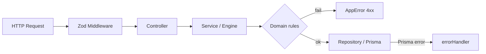
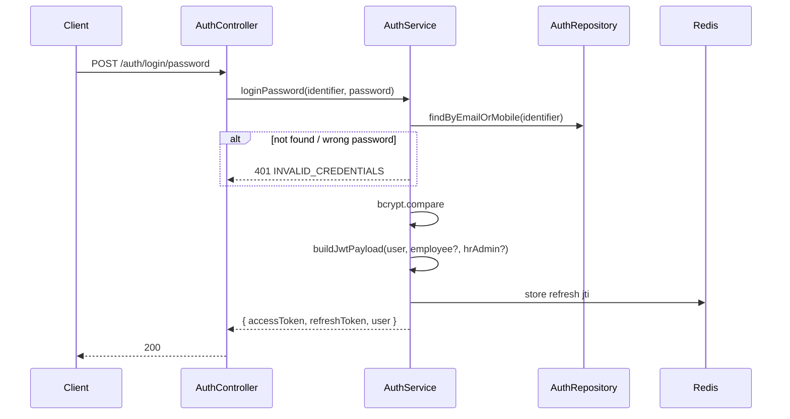
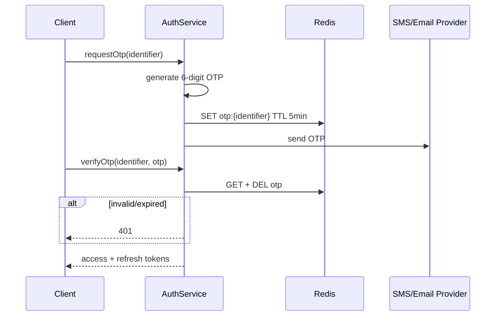
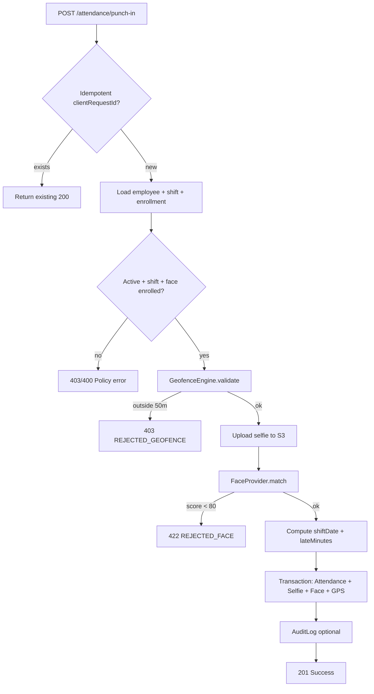
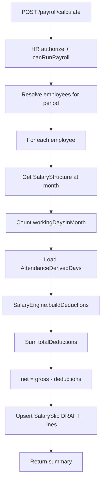
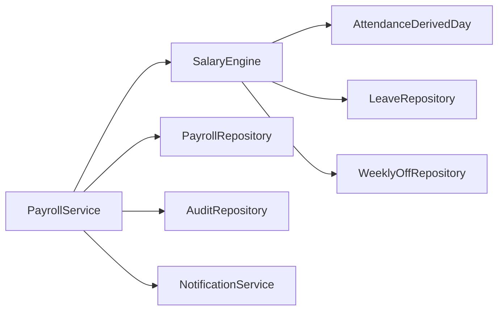
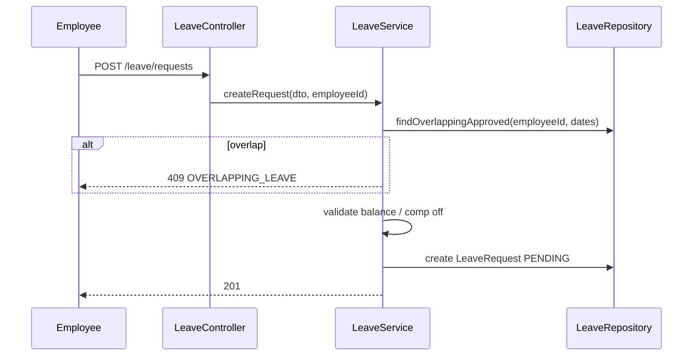
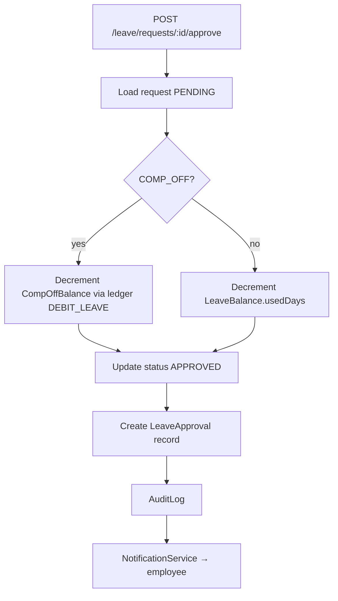
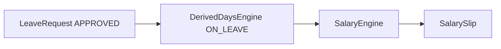

# Control Room Attendance Portal — Backend Module Blueprint

**Company:** AVSOFT CORPORATION  
**Stack:** Node.js · Express.js · TypeScript · PostgreSQL · Prisma ORM · JWT  
**API base path:** `/api/v1`  
**Document version:** 1.0  
**Sources:** [project-requirements.md](./project-requirements.md), [system-architecture.md](./system-architecture.md), [database-design.md](../database/database-design.md), [prisma-schema-plan.md](../database/prisma-schema-plan.md)

---

## Table of Contents

1. [Folder Structure](#1-folder-structure)
2. [API Modules](#2-api-modules)
3. [Controllers](#3-controllers)
4. [Services](#4-services)
5. [Repositories](#5-repositories)
6. [Middleware](#6-middleware)
7. [Validation Strategy](#7-validation-strategy)
8. [Authentication Flow](#8-authentication-flow)
9. [Attendance Engine Flow](#9-attendance-engine-flow)
10. [Salary Engine Flow](#10-salary-engine-flow)
11. [Leave Management Flow](#11-leave-management-flow)

---

## 1. Folder Structure

Layered **feature modules** under `src/modules/`, with shared infrastructure in `src/core/` and cross-cutting code in `src/common/`.

```
control-room-attendance-portal/
├── apps/
│   └── api/
│       ├── package.json
│       ├── tsconfig.json
│       ├── .env.example
│       ├── prisma/                          # Symlink or copy from repo root
│       │   ├── schema.prisma
│       │   ├── migrations/
│       │   └── seed.ts
│       └── src/
│           ├── server.ts                    # HTTP server bootstrap
│           ├── app.ts                       # Express app factory
│           ├── config/
│           │   ├── index.ts                 # Env validation (zod)
│           │   ├── database.ts
│           │   └── constants.ts             # Face threshold, geofence radius
│           ├── core/
│           │   ├── prisma/
│           │   │   ├── client.ts            # PrismaClient singleton
│           │   │   └── soft-delete.extension.ts
│           │   ├── redis/
│           │   │   └── client.ts            # OTP, refresh tokens, rate limit
│           │   ├── storage/
│           │   │   └── s3.client.ts         # Selfies, documents
│           │   └── jobs/
│           │       ├── queue.ts             # BullMQ / similar
│           │       └── workers/
│           │           ├── derived-days.worker.ts
│           │           ├── payroll.worker.ts
│           │           └── notifications.worker.ts
│           ├── common/
│           │   ├── errors/
│           │   │   ├── AppError.ts
│           │   │   ├── error-codes.ts
│           │   │   └── error-handler.middleware.ts
│           │   ├── http/
│           │   │   ├── ApiResponse.ts
│           │   │   └── async-handler.ts
│           │   ├── middleware/
│           │   │   ├── authenticate.middleware.ts
│           │   │   ├── authorize.middleware.ts
│           │   │   ├── validate.middleware.ts
│           │   │   ├── rate-limit.middleware.ts
│           │   │   ├── request-id.middleware.ts
│           │   │   └── audit.middleware.ts
│           │   ├── utils/
│           │   │   ├── haversine.ts
│           │   │   ├── shift-date.ts
│           │   │   ├── pagination.ts
│           │   │   └── mask-pii.ts
│           │   └── types/
│           │       ├── express.d.ts           # req.user augmentation
│           │       └── jwt-payload.ts
│           ├── routes/
│           │   └── index.ts                 # Mounts all module routers
│           └── modules/
│               ├── auth/
│               │   ├── auth.routes.ts
│               │   ├── auth.controller.ts
│               │   ├── auth.service.ts
│               │   ├── auth.repository.ts
│               │   ├── auth.validation.ts
│               │   └── dto/
│               ├── employees/
│               │   ├── employees.routes.ts
│               │   ├── employees.controller.ts
│               │   ├── employees.service.ts
│               │   ├── employees.repository.ts
│               │   └── employees.validation.ts
│               ├── hr-admins/
│               ├── shifts/
│               ├── weekly-off/
│               ├── attendance/
│               │   ├── attendance.routes.ts
│               │   ├── attendance.controller.ts
│               │   ├── attendance.service.ts
│               │   ├── attendance.repository.ts
│               │   ├── attendance.validation.ts
│               │   └── engines/
│               │       ├── punch.engine.ts
│               │       ├── geofence.engine.ts
│               │       └── derived-days.engine.ts
│               ├── face/
│               ├── geofence/
│               ├── leave/
│               │   ├── leave.routes.ts
│               │   ├── leave.controller.ts
│               │   ├── leave.service.ts
│               │   ├── leave.repository.ts
│               │   ├── leave.validation.ts
│               │   └── engines/
│               │       └── leave-approval.engine.ts
│               ├── comp-off/
│               ├── payroll/
│               │   ├── payroll.routes.ts
│               │   ├── payroll.controller.ts
│               │   ├── payroll.service.ts
│               │   ├── payroll.repository.ts
│               │   ├── payroll.validation.ts
│               │   └── engines/
│               │       └── salary.engine.ts
│               ├── documents/
│               ├── notifications/
│               ├── reports/
│               └── audit/
│                   └── audit.repository.ts    # Shared write helper
└── docs/
    └── backend-blueprint.md
```

### 1.1 Layer Responsibilities

| Layer | Responsibility | Must not |
|-------|----------------|----------|
| **Routes** | HTTP method, path, middleware chain | Contain business logic |
| **Controllers** | Parse request, call service, map response | Access Prisma directly |
| **Services** | Business rules, orchestration, transactions | Know about Express `req`/`res` |
| **Repositories** | Prisma queries, persistence | Enforce domain rules |
| **Engines** | Complex domain workflows (punch, salary, leave) | Handle HTTP |
| **Middleware** | Auth, validation, logging, errors | Domain calculations |

### 1.2 Module Registration Pattern

```typescript
// src/routes/index.ts
import { Router } from 'express';
import { authRoutes } from '../modules/auth/auth.routes';
import { attendanceRoutes } from '../modules/attendance/attendance.routes';
// ...

export function buildApiRouter(): Router {
  const router = Router();
  router.use('/auth', authRoutes);
  router.use('/employees', employeeRoutes);
  router.use('/attendance', attendanceRoutes);
  router.use('/leave', leaveRoutes);
  router.use('/payroll', payrollRoutes);
  // ...
  return router;
}

// src/app.ts
app.use('/api/v1', buildApiRouter());
app.use(errorHandler);
```

---

## 2. API Modules

All routes under `/api/v1`. Legend: **P** = public, **A** = authenticated, **E** = employee, **H** = HR admin.

### 2.1 Module Map

| Module | Base path | Primary responsibility |
|--------|-----------|------------------------|
| Auth | `/auth` | Login, OTP, JWT, password reset |
| Employees | `/employees` | CRUD, profile, onboarding |
| HR Admins | `/hr-admins` | Admin user management |
| Shifts | `/shifts` | Definitions, assignments |
| Weekly Off | `/weekly-off` | Rest day preference + approval |
| Attendance | `/attendance` | Punch in/out, history |
| Face | `/face` | Enrollment, status |
| Geofence | `/geofence` | Sites, pre-validation |
| Leave | `/leave` | Requests, balances, approval |
| Comp Off | `/comp-off` | Balance, ledger |
| Payroll | `/payroll` | Calculate, slips, finalize |
| Documents | `/documents` | Upload, verify |
| Notifications | `/notifications` | Preferences, logs |
| Reports | `/reports` | HR analytics exports |

### 2.2 Endpoint Catalog

#### Auth (`/auth`)

| Method | Path | Access | Description |
|--------|------|--------|-------------|
| POST | `/login/password` | P | Email or mobile + password |
| POST | `/login/otp/request` | P | Send OTP |
| POST | `/login/otp/verify` | P | Verify OTP → tokens |
| POST | `/refresh` | A | Rotate access token |
| POST | `/logout` | A | Revoke refresh token |
| POST | `/password/forgot` | P | Reset request |
| POST | `/password/reset` | P | Complete reset |

#### Employees (`/employees`)

| Method | Path | Access | Description |
|--------|------|--------|-------------|
| GET | `/me` | E | Own employee + profile |
| PATCH | `/me` | E | Update contact fields |
| GET | `/` | H | Paginated list |
| POST | `/` | H | Create user + employee + defaults |
| GET | `/:id` | H | Detail |
| PATCH | `/:id` | H | Update shift, salary, status |
| DELETE | `/:id` | H | Soft delete |

#### Attendance (`/attendance`)

| Method | Path | Access | Description |
|--------|------|--------|-------------|
| POST | `/punch-in` | E | GPS + selfie |
| POST | `/punch-out` | E | GPS + selfie |
| GET | `/me` | E | Own history |
| GET | `/` | H | All employees (filters) |
| GET | `/:employeeId` | H | Employee history |
| POST | `/weekly-off-work` | H | Credit comp off |

#### Leave (`/leave`)

| Method | Path | Access | Description |
|--------|------|--------|-------------|
| GET | `/types` | A | Leave type catalog |
| GET | `/balances/me` | E | Own balances |
| POST | `/requests` | E | Submit request |
| GET | `/requests/me` | E | Own requests |
| GET | `/requests` | H | Queue + filters |
| POST | `/requests/:id/approve` | H | Approve |
| POST | `/requests/:id/reject` | H | Reject |
| POST | `/requests/:id/cancel` | E | Cancel pending |

#### Payroll (`/payroll`)

| Method | Path | Access | Description |
|--------|------|--------|-------------|
| POST | `/calculate` | H | Run draft for month/year |
| GET | `/` | H | List slips |
| GET | `/me` | E | Own finalized slips |
| GET | `/:id` | E/H | Detail + deductions |
| POST | `/:id/finalize` | H | Lock slip |
| GET | `/export` | H | CSV/PDF |

*Full endpoint list: [system-architecture.md §8](./system-architecture.md).*

### 2.3 Standard Response Envelope

```typescript
interface ApiSuccess<T> {
  success: true;
  data: T;
  meta?: { page?: number; limit?: number; total?: number };
  requestId: string;
}

interface ApiError {
  success: false;
  error: { code: string; message: string; details?: unknown };
  requestId: string;
}
```

### 2.4 HTTP Status Conventions

| Code | When |
|------|------|
| 200 | GET, PATCH success |
| 201 | Created (punch, leave, employee) |
| 400 | Validation failed |
| 401 | Missing/invalid JWT |
| 403 | Wrong role or geofence denied |
| 404 | Resource not found |
| 409 | Duplicate punch, insufficient leave/comp off |
| 422 | Face match &lt; 80% |
| 500 | Unhandled server error |

---

## 3. Controllers

Controllers are thin: extract input → call service → return `ApiResponse`.

### 3.1 Controller Inventory

| Module | Controller | Key methods |
|--------|------------|-------------|
| auth | `AuthController` | `loginPassword`, `requestOtp`, `verifyOtp`, `refresh`, `logout`, `forgotPassword`, `resetPassword` |
| employees | `EmployeesController` | `getMe`, `updateMe`, `list`, `create`, `getById`, `update`, `deactivate` |
| shifts | `ShiftsController` | `list`, `assign`, `getMyShift` |
| weekly-off | `WeeklyOffController` | `submitPreference`, `getMyPreference`, `listPending`, `approve`, `reject` |
| attendance | `AttendanceController` | `punchIn`, `punchOut`, `getMyHistory`, `list`, `getByEmployee`, `markWeeklyOffWork` |
| face | `FaceController` | `enroll`, `enrollSelf`, `getStatus` |
| geofence | `GeofenceController` | `listSites`, `createSite`, `updateSite`, `validateLocation` |
| leave | `LeaveController` | `getTypes`, `getMyBalances`, `createRequest`, `getMyRequests`, `listRequests`, `approve`, `reject`, `cancel` |
| comp-off | `CompOffController` | `getMyBalance`, `getBalance`, `getLedger` |
| payroll | `PayrollController` | `calculate`, `list`, `getMySlips`, `getById`, `finalize`, `export` |
| documents | `DocumentsController` | `upload`, `getMine`, `getByEmployee`, `verify` |
| notifications | `NotificationsController` | `getPreferences`, `updatePreferences`, `getHistory` |
| reports | `ReportsController` | `attendanceSummary`, `leaveSummary`, `lateAbsentPreview` |

### 3.2 Example Controller

```typescript
// modules/attendance/attendance.controller.ts
export class AttendanceController {
  constructor(private readonly attendanceService: AttendanceService) {}

  punchIn = asyncHandler(async (req: Request, res: Response) => {
    const employeeId = req.user!.employeeId!;
    const result = await this.attendanceService.punchIn(employeeId, req.body, {
      clientRequestId: req.headers['x-request-id'] as string,
      ip: req.ip,
      userAgent: req.get('user-agent'),
    });
    return res.status(201).json(ApiResponse.created(result, req.requestId));
  });
}
```

### 3.3 Controller Rules

- Never import `@prisma/client` in controllers.
- Use `req.user` from JWT middleware (`userId`, `role`, `employeeId`, `hrAdminId`, `companyId`).
- Employee routes: reject if `employeeId` missing on token.
- HR routes: `authorize('HR_ADMIN')` + optional permission flags (`canRunPayroll`, etc.).

---

## 4. Services

Services implement use cases and coordinate repositories, engines, and external adapters.

### 4.1 Service Inventory

| Service | Depends on | Responsibilities |
|---------|------------|------------------|
| `AuthService` | AuthRepository, Redis, JwtService | Login, OTP, tokens, password hash |
| `EmployeesService` | EmployeesRepository, AuthRepository | Onboarding, profile, deactivate |
| `ShiftsService` | ShiftsRepository | Assign shift, resolve current shift |
| `WeeklyOffService` | WeeklyOffRepository, NotificationService | Preference workflow |
| `AttendanceService` | AttendanceRepository, **PunchEngine** | Punch in/out, history |
| `FaceService` | FaceRepository, FaceProviderAdapter | Enroll, match |
| `GeofenceService` | GeofenceRepository, **GeofenceEngine** | Sites, distance check |
| `LeaveService` | LeaveRepository, **LeaveApprovalEngine**, CompOffService | Requests, balances |
| `CompOffService` | CompOffRepository | Ledger, balance |
| `PayrollService` | PayrollRepository, **SalaryEngine**, AttendanceRepository | Calculate, finalize |
| `DocumentsService` | DocumentsRepository, StorageAdapter | Upload URLs, verify |
| `NotificationService` | NotificationRepository, providers | Queue WhatsApp/email/push |
| `ReportsService` | Multiple repositories | Aggregations |

### 4.2 Service Transaction Pattern

```typescript
// modules/leave/leave.service.ts
async approveRequest(leaveRequestId: string, hrAdminId: string, remarks?: string) {
  return this.prisma.$transaction(async (tx) => {
    const repo = this.leaveRepository.withTransaction(tx);
    return this.leaveApprovalEngine.approve({
      leaveRequestId,
      hrAdminId,
      remarks,
      leaveRepo: repo,
      compOffRepo: this.compOffRepository.withTransaction(tx),
      notificationService: this.notificationService,
    });
  });
}
```

### 4.3 External Adapters (injected into services/engines)

| Adapter | Used by |
|---------|---------|
| `FaceProviderAdapter` | PunchEngine, FaceService |
| `StorageAdapter` (S3) | AttendanceService, DocumentsService |
| `WhatsAppProvider` | NotificationService |
| `EmailProvider` | NotificationService |
| `PushProvider` | NotificationService |

---

## 5. Repositories

Repositories wrap Prisma; one repository per aggregate, optional transaction scope.

### 5.1 Repository Inventory

| Repository | Prisma models | Key methods |
|------------|---------------|-------------|
| `AuthRepository` | UserAuth | `findByEmail`, `findByMobile`, `updateLastLogin`, `createUser` |
| `EmployeesRepository` | Employee, EmployeeProfile, NotificationPreference, CompOffBalance | `findById`, `findByUserId`, `createWithProfile`, `softDelete`, `listPaginated` |
| `HrAdminsRepository` | HRAdmin | `findByUserId`, `create` |
| `ShiftsRepository` | Shift, ShiftAssignment | `getCurrentAssignment`, `assignShift`, `listDefinitions` |
| `WeeklyOffRepository` | WeeklyOff, WeeklyOffApproval, WeeklyOffWorkLog | `createPreference`, `approve`, `getApprovedDay` |
| `AttendanceRepository` | Attendance, AttendanceSelfie, FaceVerification, GPSLog | `createPunchBundle`, `findOpenPunchIn`, `listByEmployee`, `idempotentFind` |
| `FaceRepository` | FaceEnrollment | `getActiveEnrollment`, `createEnrollment`, `revoke` |
| `GeofenceRepository` | ControlRoomSite | `getActiveSite`, `listSites`, `upsertSite` |
| `LeaveRepository` | LeaveRequest, LeaveApproval, LeaveBalance, LeaveType | `createRequest`, `approve`, `deductBalance`, `findOverlapping` |
| `CompOffRepository` | CompOffLedger, CompOffBalance | `appendEntry`, `getBalance` |
| `PayrollRepository` | SalaryStructure, SalarySlip, SalaryDeduction, AttendanceDerivedDay | `getStructureAt`, `upsertSlip`, `addDeductions`, `finalizeSlip` |
| `DocumentsRepository` | EmployeeDocument | `create`, `listByEmployee`, `markVerified` |
| `NotificationRepository` | NotificationPreference, NotificationLog | `getPreferences`, `logDelivery` |
| `AuditRepository` | AuditLog | `write` |

### 5.2 Repository Base Pattern

```typescript
// core/prisma/base.repository.ts
export abstract class BaseRepository {
  constructor(protected readonly prisma: PrismaClient | Prisma.TransactionClient) {}

  withTransaction(tx: Prisma.TransactionClient): this {
    return new (this.constructor as any)(tx);
  }
}
```

### 5.3 Example Repository Method

```typescript
// modules/attendance/attendance.repository.ts
async createPunchBundle(input: CreatePunchBundleInput) {
  return this.prisma.attendance.create({
    data: {
      employeeId: input.employeeId,
      companyId: input.companyId,
      punchType: input.punchType,
      punchedAt: input.punchedAt,
      shiftDate: input.shiftDate,
      clientRequestId: input.clientRequestId,
      status: input.status,
      lateMinutes: input.lateMinutes,
      shiftAssignmentId: input.shiftAssignmentId,
      controlRoomSiteId: input.controlRoomSiteId,
      selfie: { create: input.selfie },
      faceVerification: { create: input.faceVerification },
      gpsLog: { create: input.gpsLog },
    },
    include: { selfie: true, faceVerification: true, gpsLog: true },
  });
}
```

### 5.4 Soft Delete

Apply via Prisma extension or explicit `where: { deletedAt: null }` in `AuthRepository`, `EmployeesRepository`, `HrAdminsRepository`.

---

## 6. Middleware

### 6.1 Global Middleware Stack (order matters)

```typescript
app.use(helmet());
app.use(cors({ origin: config.CORS_ORIGINS }));
app.use(express.json({ limit: '2mb' }));
app.use(requestIdMiddleware);
app.use(httpLogger);
app.use('/api/v1', apiRateLimiter);
```

### 6.2 Middleware Catalog

| Middleware | Scope | Purpose |
|------------|-------|---------|
| `requestIdMiddleware` | Global | Set `X-Request-Id`, attach to `req.requestId` |
| `httpLogger` | Global | Pino / Winston structured logs |
| `apiRateLimiter` | `/api/v1` | 100 req/min per IP (configurable) |
| `authenticate` | Protected routes | Verify JWT access token |
| `authorize(...roles)` | Route-level | `EMPLOYEE` / `HR_ADMIN` |
| `authorizePermission(flag)` | HR routes | `canRunPayroll`, etc. |
| `validate(schema)` | Route-level | Zod body/query/params |
| `uploadSelfie` | Punch routes | Multer → memory → size limit |
| `uploadDocument` | Document routes | Multer + MIME allowlist |
| `auditContext` | HR mutations | Attach actor for AuditRepository |
| `errorHandler` | Last | Map `AppError` → HTTP response |

### 6.3 Authentication Middleware

```typescript
// common/middleware/authenticate.middleware.ts
export function authenticate(req: Request, _res: Response, next: NextFunction) {
  const header = req.headers.authorization;
  if (!header?.startsWith('Bearer ')) throw new AppError(401, 'UNAUTHORIZED');
  const payload = jwtService.verifyAccess(header.slice(7));
  req.user = {
    userId: payload.sub,
    role: payload.role,
    companyId: payload.companyId,
    employeeId: payload.employeeId,
    hrAdminId: payload.hrAdminId,
  };
  next();
}
```

### 6.4 Authorization Middleware

```typescript
export const authorize =
  (...roles: UserRole[]) =>
  (req: Request, _res: Response, next: NextFunction) => {
    if (!req.user || !roles.includes(req.user.role)) {
      throw new AppError(403, 'FORBIDDEN');
    }
    next();
  };

export const requireEmployee = (req: Request) => {
  if (!req.user?.employeeId) throw new AppError(403, 'EMPLOYEE_PROFILE_REQUIRED');
};
```

### 6.5 Ownership Guard (employee self-access)

```typescript
export const assertOwnEmployee = (req: Request, targetEmployeeId: string) => {
  if (req.user!.role === 'EMPLOYEE' && req.user!.employeeId !== targetEmployeeId) {
    throw new AppError(403, 'FORBIDDEN');
  }
};
```

---

## 7. Validation Strategy

### 7.1 Stack

| Tool | Use |
|------|-----|
| **Zod** | Request body, query, params schemas |
| **validate.middleware** | Runs `schema.parse()` before controller |
| **Prisma** | DB-level constraints (last line of defense) |
| **AppError** | Domain validation failures (409, 422) |

### 7.2 Schema Location

Per module: `*.validation.ts` exporting schemas and inferred TypeScript types.

```typescript
// modules/attendance/attendance.validation.ts
import { z } from 'zod';

export const punchSchema = z.object({
  latitude: z.number().min(-90).max(90),
  longitude: z.number().min(-180).max(180),
  accuracyMeters: z.number().positive().optional(),
  clientRequestId: z.string().min(8).max(64),
  selfieBase64: z.string().min(100), // or multipart handled separately
});

export type PunchDto = z.infer<typeof punchSchema>;
```

### 7.3 Route Wiring

```typescript
router.post(
  '/punch-in',
  authenticate,
  authorize('EMPLOYEE'),
  uploadSelfie.single('selfie'),
  validate({ body: punchSchema }),
  attendanceController.punchIn,
);
```

### 7.4 Validation Layers



| Layer | Examples |
|-------|----------|
| Zod | Email format, date ranges, enum values |
| Service | Employee active, shift assigned |
| Engine | Geofence ≤ 50 m, face ≥ 80%, no duplicate punch |
| DB | Unique `clientRequestId`, FK integrity |

### 7.5 Common Schemas

| Module | Schema | Notes |
|--------|--------|-------|
| auth | `loginPasswordSchema` | `identifier` + `password` |
| auth | `otpVerifySchema` | `identifier`, `otp`, `deviceId?` |
| employees | `createEmployeeSchema` | HR create: user + employee + salary |
| leave | `createLeaveRequestSchema` | `startDate` ≤ `endDate`, `leaveTypeCode` |
| payroll | `calculatePayrollSchema` | `year`, `month`, `employeeIds?` |
| geofence | `createSiteSchema` | lat/lng, `radiusMeters` default 50 |

---

## 8. Authentication Flow

Supports **email**, **mobile**, **password**, and **OTP** per requirements.

### 8.1 JWT Token Model

| Token | TTL | Storage | Claims |
|-------|-----|---------|--------|
| Access | 15 min | Client memory | `sub`, `role`, `companyId`, `employeeId?`, `hrAdminId?` |
| Refresh | 7 days | Redis + httpOnly cookie (web) / secure storage (mobile) | `sub`, `jti` |

### 8.2 Password Login Sequence



### 8.3 OTP Login Sequence



### 8.4 Refresh Flow

1. Client sends `POST /auth/refresh` with refresh token.
2. Verify signature + `jti` exists in Redis and not revoked.
3. Issue new access token (optional refresh rotation).
4. On logout: delete `jti` from Redis.

### 8.5 AuthService Dependencies

```typescript
class AuthService {
  constructor(
    private authRepo: AuthRepository,
    private employeesRepo: EmployeesRepository,
    private hrAdminsRepo: HrAdminsRepository,
    private jwtService: JwtService,
    private redis: RedisClient,
  ) {}
}
```

### 8.6 Security Checklist

- bcrypt cost factor ≥ 12
- Rate limit `/auth/login/*` and `/auth/login/otp/request` (5/min per identifier)
- Normalize email (lowercase); validate E.164 mobile
- Never return whether email exists on forgot-password (generic message)
- Include `companyId` in JWT to scope all queries

---

## 9. Attendance Engine Flow

The **PunchEngine** is the core domain orchestrator for punch in/out. Invoked by `AttendanceService`.

### 9.1 Components

| Component | Role |
|-----------|------|
| `PunchEngine` | Orchestrate full punch pipeline |
| `GeofenceEngine` | Haversine distance vs site radius (50 m) |
| `FaceProviderAdapter` | Compare selfie to enrollment (≥ 80%) |
| `ShiftDateResolver` | Compute `shiftDate` (night shift aware) |
| `DerivedDaysEngine` | Batch: PRESENT / LATE / ABSENT / etc. |

### 9.2 Punch In Flow



### 9.3 PunchEngine Pseudocode

```typescript
class PunchEngine {
  async executePunchIn(ctx: PunchContext): Promise<PunchResult> {
    const existing = await this.attendanceRepo.findByClientRequestId(
      ctx.employeeId, ctx.clientRequestId,
    );
    if (existing) return { attendance: existing, idempotent: true };

    await this.policyGuard.assertCanPunch(ctx.employeeId);

    const site = await this.geofenceRepo.getActiveSite(ctx.companyId);
    const geo = this.geofenceEngine.validate(ctx.lat, ctx.lng, site);
    if (!geo.withinGeofence) throw new AppError(403, 'GEOFENCE_FAILED', { distance: geo.distanceMeters });

    const enrollment = await this.faceRepo.getActiveEnrollment(ctx.employeeId);
    const selfieUrl = await this.storage.uploadSelfie(ctx.selfieBuffer, ctx.employeeId);
    const face = await this.faceProvider.compare(selfieUrl, enrollment);
    if (!face.passed) throw new AppError(422, 'FACE_VERIFICATION_FAILED', { score: face.matchScore });

    const shift = await this.shiftsRepo.getCurrentAssignment(ctx.employeeId);
    const shiftDate = this.shiftDateResolver.resolve(shift, new Date());
    const lateMinutes = this.computeLateMinutes(shift, new Date());

    return this.attendanceRepo.createPunchBundle({
      punchType: 'IN',
      status: 'VALID',
      shiftDate,
      lateMinutes,
      geo,
      face,
      selfieUrl,
      ...ctx,
    });
  }
}
```

### 9.4 Punch Out Rules

- Must have `VALID` punch `IN` for same `shiftDate` without matching `OUT`.
- Same geofence + face pipeline.
- No `lateMinutes` on OUT.

### 9.5 Weekly Off Work (HR)

`AttendanceService.markWeeklyOffWork`:

1. Verify date is employee's **approved** weekly off.
2. Create `WeeklyOffWorkLog`.
3. `CompOffService.credit(+1)` → ledger entry `CREDIT_WEEKLY_OFF_WORK`.
4. Notify employee.

### 9.6 Derived Days Batch (cron / queue)

Nightly `DerivedDaysEngine` per employee per calendar day:

| Condition | Status |
|-----------|--------|
| Approved leave | `ON_LEAVE` |
| Approved weekly off | `WEEKLY_OFF` |
| Valid IN + OUT | `PRESENT` |
| IN late ≤ 120 min | `LATE` |
| IN late > 120 min | `HALF_DAY` |
| Working day, no IN | `ABSENT` |

Upsert `AttendanceDerivedDay` for payroll consumption.

---

## 10. Salary Engine Flow

The **SalaryEngine** computes monthly `SalarySlip` + `SalaryDeduction` rows from `AttendanceDerivedDay` and company rules.

### 10.1 Salary Rules (from requirements)

| Rule | Trigger | Calculation |
|------|---------|-------------|
| Fixed gross | `SalaryStructure.fixedMonthlyGross` | Base for month |
| Full day absent | `derivedDay.status = ABSENT` on working day | `dailyRate = gross / workingDaysInMonth` |
| Late ≤ 2 hours | `LATE` with `lateMinutes` ≤ 120 | `hourlyRate = dailyRate / standardHours`; deduct `lateHours × hourlyRate` |
| Late > 2 hours | `LATE` with `lateMinutes` > 120 | Deduct `0.5 × dailyRate` (`LATE_HALF_DAY`) |

### 10.2 Payroll Calculate Flow



### 10.3 SalaryEngine Interface

```typescript
interface SalaryEngineInput {
  employeeId: string;
  year: number;
  month: number;
  structure: SalaryStructure;
  derivedDays: AttendanceDerivedDay[];
  companySettings: CompanySettings;
}

interface SalaryEngineOutput {
  grossSalary: Decimal;
  workingDaysInMonth: number;
  presentDays: Decimal;
  absentDays: Decimal;
  deductions: CreateDeductionInput[];
  totalDeductions: Decimal;
  netSalary: Decimal;
}

class SalaryEngine {
  build(input: SalaryEngineInput): SalaryEngineOutput {
    const dailyRate = input.structure.fixedMonthlyGross.div(workingDays);
    // iterate derivedDays → push ABSENT / LATE_HOURLY / LATE_HALF_DAY lines
    // ...
  }
}
```

### 10.4 Finalize Flow

1. HR calls `POST /payroll/:id/finalize`.
2. Service checks `status === DRAFT` and HR permission.
3. Update slip → `FINALIZED`, set `finalizedAt`, `finalizedByHrAdminId`.
4. Reject further deduction edits (service + DB trigger).
5. `NotificationService` → employee (channels per preferences).
6. Optional: generate PDF → `payslipPdfUrl`.

### 10.5 Payroll Module Dependencies



---

## 11. Leave Management Flow

### 11.1 Leave Types

| Code | Balance source |
|------|----------------|
| `CASUAL` | `LeaveBalance` annual bucket |
| `SICK` | `LeaveBalance` |
| `PAID` | `LeaveBalance` |
| `COMP_OFF` | `CompOffBalance` only (not leave_balances) |

### 11.2 Submit Leave Request (Employee)



**Validation rules:**

- `startDate` ≤ `endDate`; `totalDays` > 0.
- `COMP_OFF`: `totalDays` ≤ `compOffBalance`.
- Other types: `remainingDays` ≥ `totalDays` (pending does not deduct until approved).

### 11.3 Approve Leave (HR) — LeaveApprovalEngine



```typescript
class LeaveApprovalEngine {
  async approve(tx: TransactionContext, input: ApproveInput) {
    const request = await input.leaveRepo.getForUpdate(input.leaveRequestId);
    if (request.status !== 'PENDING') throw new AppError(409, 'INVALID_STATE');

    if (request.leaveType.code === 'COMP_OFF') {
      await input.compOffRepo.debit(input.employeeId, request.totalDays, request.id);
    } else {
      await input.leaveRepo.deductBalance(input.employeeId, request.leaveTypeId, request.totalDays);
    }

    await input.leaveRepo.markApproved(request.id, input.hrAdminId, input.remarks);
  }
}
```

### 11.4 Reject / Cancel

| Action | Actor | Result |
|--------|-------|--------|
| Reject | HR | `REJECTED` + `LeaveApproval` + notify |
| Cancel | Employee | Only if `PENDING` → `CANCELLED` |

No balance change on reject/cancel.

### 11.5 Weekly Off (related workflow)

Managed by `WeeklyOffService` (not LeaveService):

1. Employee `POST /weekly-off/preferences` → `PENDING`.
2. HR approve → `APPROVED` (used by attendance absence logic).
3. Does not consume leave balance.

### 11.6 Leave ↔ Attendance ↔ Payroll



Approved leave dates mark `AttendanceDerivedDay.status = ON_LEAVE` so employee is not marked `ABSENT`.

---

## Appendix A — Dependency Injection

Use a lightweight container or manual factory in `src/core/container.ts`:

```typescript
export function buildContainer(prisma: PrismaClient) {
  const authRepo = new AuthRepository(prisma);
  const attendanceRepo = new AttendanceRepository(prisma);
  const punchEngine = new PunchEngine(/* deps */);
  const attendanceService = new AttendanceService(attendanceRepo, punchEngine);
  const attendanceController = new AttendanceController(attendanceService);
  return { attendanceController, /* ... */ };
}
```

For larger teams, consider `tsyringe` or `awilix`.

---

## Appendix B — Environment Variables

| Variable | Purpose |
|----------|---------|
| `DATABASE_URL` | PostgreSQL connection |
| `JWT_ACCESS_SECRET` | Access token signing |
| `JWT_REFRESH_SECRET` | Refresh token signing |
| `REDIS_URL` | OTP + refresh token store |
| `S3_BUCKET`, `S3_REGION`, `S3_ACCESS_KEY` | File storage |
| `FACE_API_KEY` | Face recognition provider |
| `TWILIO_*` / `SENDGRID_*` | Notifications |

---

## Appendix C — Implementation Order

| Phase | Modules |
|-------|---------|
| 1 | Core, Prisma, Auth, Employees |
| 2 | Shifts, Geofence, Face, Attendance + PunchEngine |
| 3 | Weekly Off, Leave, Comp Off |
| 4 | Derived days job, Payroll + SalaryEngine |
| 5 | Documents, Notifications, Reports, Audit |

---

## Appendix D — Document Cross-Reference

| Topic | Document |
|-------|----------|
| REST endpoints | [system-architecture.md §8](./system-architecture.md) |
| Tables & constraints | [database-design.md](../database/database-design.md) |
| Prisma models | [prisma-schema-plan.md](../database/prisma-schema-plan.md) |
| Business rules | [project-requirements.md](./project-requirements.md) |

---

*Blueprint for `apps/api` implementation. Copy patterns module-by-module starting with Auth and Attendance.*
