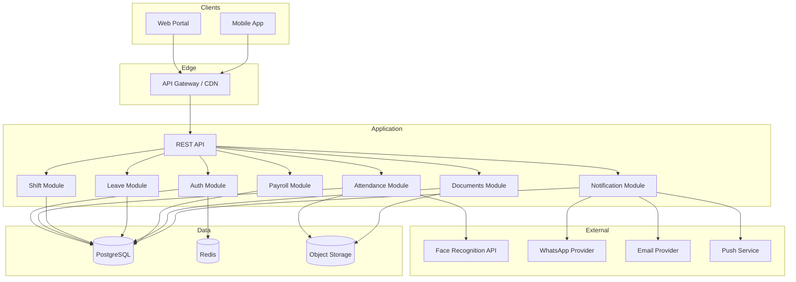
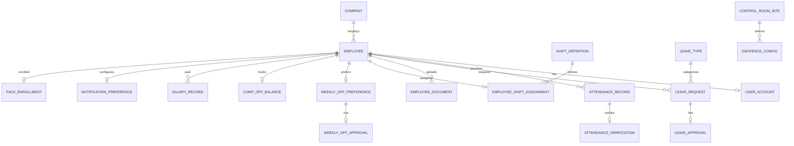
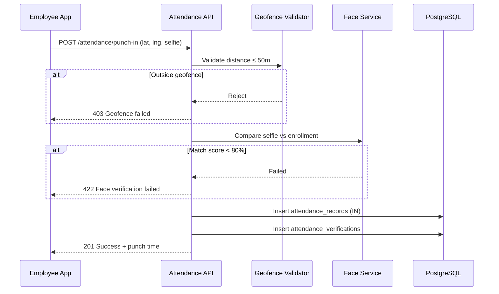
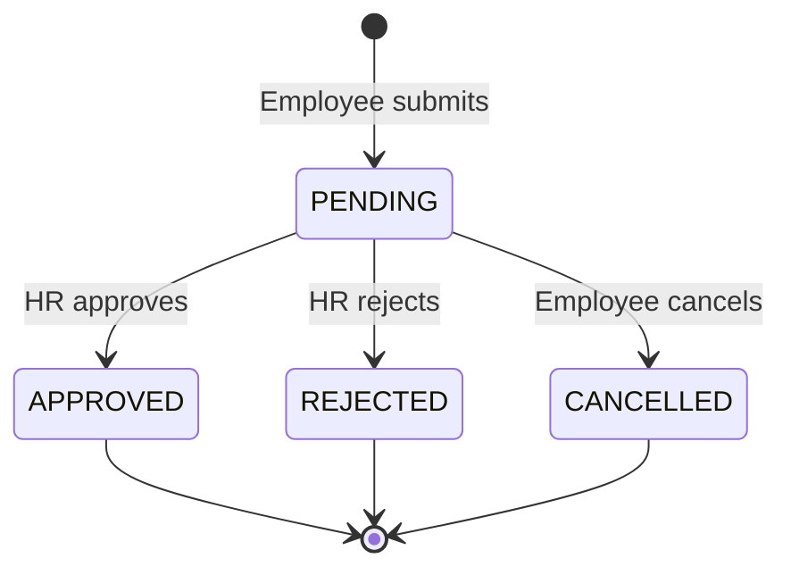
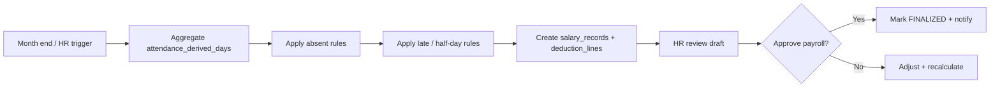
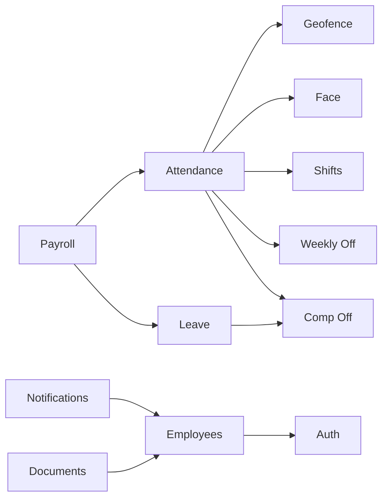

# Control Room Attendance Portal — System Architecture

**Company:** AVSOFT CORPORATION  
**Portal:** Control Room Attendance Portal  
**Document version:** 1.0  
**Source:** [project-requirements.md](./project-requirements.md)

---

## 1. System Architecture

### 1.1 Overview

The Control Room Attendance Portal is a multi-channel workforce management system for ~50 employees (scaling to 100+) that enforces location- and identity-verified attendance, manages shifts and leave, computes salary deductions, and stores employee documents. HR admins configure policies and approve requests; employees punch in/out, request leave, and manage their profile.

### 1.2 Architecture Style

| Layer | Technology (recommended) | Responsibility |
|-------|--------------------------|----------------|
| **Client — Web** | React / Next.js | HR dashboard, employee self-service, reports |
| **Client — Mobile** | React Native or Flutter | Punch in/out, GPS, camera, push notifications |
| **API Gateway** | Nginx / cloud load balancer | TLS termination, rate limiting, routing |
| **Application API** | Node.js (NestJS) or .NET / Java Spring | REST (optionally GraphQL) business logic |
| **Auth Service** | Integrated module + Redis | JWT sessions, OTP, password, email/mobile identity |
| **Face Verification** | External API (e.g. AWS Rekognition) or on-prem model | Selfie vs enrolled face; ≥80% match threshold |
| **Geofence Service** | Application logic + PostGIS / Haversine | 50 m radius validation against control-room coordinates |
| **Job Queue** | Bull / RabbitMQ / SQS | Salary runs, notifications, report generation |
| **Object Storage** | S3-compatible (MinIO / AWS S3) | Selfies, employee documents (encrypted at rest) |
| **Database** | PostgreSQL | Relational data, audit trails |
| **Cache** | Redis | OTP codes, session, geofence config, rate limits |
| **Notifications** | Twilio (WhatsApp/SMS), SendGrid (email), FCM/APNs | Multi-channel delivery per user preference |

### 1.3 High-Level Component Diagram



### 1.4 Deployment Topology

- **Environment:** Development, Staging, Production (isolated DB and secrets).
- **Hosting:** Cloud VM or container platform (Docker + Kubernetes or managed PaaS).
- **Scaling:** Stateless API replicas behind load balancer; PostgreSQL primary + read replica when employee count exceeds ~100; Redis cluster for HA.
- **Security:** HTTPS only, secrets in vault, RBAC on all endpoints, PII encryption for documents and biometrics metadata, audit log for HR actions.

### 1.5 Cross-Cutting Concerns

| Concern | Approach |
|---------|----------|
| **Authentication** | Email, mobile, password, and OTP flows unified under one identity per employee |
| **Authorization** | Role-based: `HR_ADMIN`, `EMPLOYEE`; resource-level checks (own attendance vs all) |
| **Time zone** | Store UTC in DB; display in company locale (configure `Asia/Kolkata` or org default) |
| **Idempotency** | Punch and payment operations use client request IDs to prevent duplicates |
| **Observability** | Structured logs, metrics (punch latency, face match failures), alerting on API errors |

---

## 2. Database Architecture

### 2.1 Entity Relationship (Conceptual)



### 2.2 Core Tables

#### Organization & users

| Table | Key columns | Notes |
|-------|-------------|-------|
| `companies` | `id`, `name` (AVSOFT CORPORATION), `settings_json` | Single-tenant or row for org |
| `users` | `id`, `email`, `mobile`, `password_hash`, `role`, `is_active` | `role`: `HR_ADMIN`, `EMPLOYEE` |
| `employees` | `id`, `user_id`, `employee_code`, `name`, `department`, `join_date`, `fixed_monthly_salary`, `status` | Links to `users` |

#### Shifts & weekly off

| Table | Key columns | Notes |
|-------|-------------|-------|
| `shift_definitions` | `id`, `name`, `start_time`, `end_time`, `crosses_midnight` | Morning 06:00–14:00, Evening 14:00–22:00, Night 22:00–06:00 |
| `employee_shift_assignments` | `employee_id`, `shift_id`, `effective_from`, `effective_to` | Historical assignment |
| `weekly_off_preferences` | `id`, `employee_id`, `day_of_week`, `status` | `PENDING`, `APPROVED`, `REJECTED` |
| `weekly_off_approvals` | `preference_id`, `approved_by`, `approved_at`, `remarks` | HR approval trail |

#### Attendance & verification

| Table | Key columns | Notes |
|-------|-------------|-------|
| `control_room_sites` | `id`, `name`, `latitude`, `longitude` | Control room location |
| `geofence_configs` | `site_id`, `radius_meters` (default 50) | Per-site geofence |
| `face_enrollments` | `employee_id`, `reference_image_url`, `external_face_id`, `enrolled_at` | Baseline for matching |
| `attendance_records` | `id`, `employee_id`, `punch_type`, `punched_at`, `shift_date`, `latitude`, `longitude`, `within_geofence`, `status` | `punch_type`: `IN`, `OUT` |
| `attendance_verifications` | `attendance_id`, `selfie_url`, `match_score`, `passed` (score ≥ 80), `provider_response_json` | Face verification audit |

#### Leave & comp off

| Table | Key columns | Notes |
|-------|-------------|-------|
| `leave_types` | `id`, `code`, `name` | `CASUAL`, `SICK`, `PAID`, `COMP_OFF` |
| `leave_balances` | `employee_id`, `leave_type_id`, `year`, `allocated`, `used`, `remaining` | Annual buckets |
| `comp_off_balances` | `employee_id`, `balance` | +1 on weekly-off work, −1 on comp-off leave |
| `leave_requests` | `id`, `employee_id`, `leave_type_id`, `start_date`, `end_date`, `days`, `reason`, `status` | `PENDING`, `APPROVED`, `REJECTED`, `CANCELLED` |
| `leave_approvals` | `leave_request_id`, `approved_by`, `approved_at`, `remarks` | HR workflow |
| `weekly_off_work_logs` | `employee_id`, `work_date`, `comp_off_credited` | Triggers +1 comp off |

#### Payroll

| Table | Key columns | Notes |
|-------|-------------|-------|
| `salary_records` | `id`, `employee_id`, `month`, `year`, `gross_salary`, `absent_deduction`, `late_deduction`, `net_salary`, `status` | Monthly snapshot |
| `salary_deduction_lines` | `salary_record_id`, `type`, `date`, `amount`, `description` | `ABSENT`, `LATE_HOURLY`, `LATE_HALF_DAY` |
| `attendance_derived_days` | `employee_id`, `date`, `status` | `PRESENT`, `ABSENT`, `HALF_DAY`, `LATE` — fed from punches |

#### Documents & notifications

| Table | Key columns | Notes |
|-------|-------------|-------|
| `employee_documents` | `id`, `employee_id`, `document_type`, `file_url`, `uploaded_at`, `verified_by` | Types: Aadhaar, PAN, Bank Passbook, etc. |
| `notification_preferences` | `employee_id`, `whatsapp`, `email`, `mobile_app`, `web_portal` | Boolean flags per channel |
| `notification_logs` | `id`, `employee_id`, `channel`, `template`, `status`, `sent_at` | Delivery audit |

### 2.3 Indexing Strategy

- `attendance_records (employee_id, shift_date)` — daily punch lookup.
- `leave_requests (employee_id, status, start_date)` — HR queue and calendar.
- `salary_records (employee_id, year, month)` UNIQUE — one payroll row per employee per month.
- `users (email)` UNIQUE, `users (mobile)` UNIQUE — login identifiers.

### 2.4 Data Retention & Compliance

- Attendance and verification images: retain per company policy (e.g. 12–24 months), then archive or purge.
- Employee documents: retain for employment duration + statutory period.
- All HR approvals and salary adjustments: immutable audit rows (no hard delete).

---

## 3. User Roles

### 3.1 Role Matrix

| Capability | HR Admin | Employee |
|------------|:--------:|:--------:|
| Login (email / mobile / password / OTP) | ✓ | ✓ |
| Punch in / out (GPS + face) | — | ✓ |
| View own attendance & salary | — | ✓ |
| Upload / view own documents | — | ✓ |
| Set notification preferences | — | ✓ |
| Request leave | — | ✓ |
| Select weekly rest day (pending approval) | — | ✓ |
| View comp off balance | — | ✓ |
| Manage all employees | ✓ | — |
| Approve weekly off preference | ✓ | — |
| Approve / reject leave | ✓ | — |
| Assign shifts | ✓ | — |
| Configure geofence / control room site | ✓ | — |
| Enroll / re-enroll employee face | ✓ | — |
| Run monthly salary calculation | ✓ | — |
| Verify employee documents | ✓ | — |
| Reports & exports | ✓ | — |

### 3.2 Identity Model

- One `users` row per person; `employees` extends profile for staff.
- HR admins may or may not have an `employees` row (configurable); if they punch attendance, they need employee linkage.
- Authentication factors: password + optional OTP for sensitive actions; OTP also usable as primary login method per requirements.

### 3.3 Permission Enforcement

- API middleware validates JWT and `role` claim.
- Employees: `employee_id` on token must match resource `employee_id`.
- HR: access to tenant-wide resources; sensitive actions logged in `audit_logs`.

---

## 4. Attendance Workflow

### 4.1 Preconditions

1. Employee account active and shift assigned.
2. Face enrolled (`face_enrollments` with valid reference).
3. Mobile app has location and camera permissions.
4. Control room geofence configured (50 m radius).

### 4.2 Punch In Sequence



### 4.3 Punch Out

- Same validation pipeline as punch in with `punch_type = OUT`.
- Business rules: cannot punch out without an open punch in for the same `shift_date`; no duplicate IN without OUT.

### 4.4 Shift Date & Night Shift

- **Shift date** is derived from assigned shift window, not calendar midnight alone.
- Night shift (22:00–06:00): `shift_date` = calendar date of shift start; punches after midnight belong to same shift instance.

### 4.5 Late Arrival Detection

| Condition | Flag |
|-----------|------|
| Punch in ≤ grace period after shift start | On time |
| Late ≤ 2 hours | `LATE` — hourly deduction basis |
| Late > 2 hours | `HALF_DAY` — half-day salary rule |
| No punch in on working day (not on approved leave / weekly off) | `ABSENT` — full day deduction |

Grace period (e.g. 5–15 minutes) should be defined in `companies.settings_json`.

### 4.6 Weekly Off Work → Comp Off

When HR or system marks that an employee worked on an **approved weekly off** day:

1. Log in `weekly_off_work_logs`.
2. Increment `comp_off_balances.balance` by 1.
3. Notify employee via preferred channels.

---

## 5. Leave Workflow

### 5.1 Leave Types

| Code | Name | Balance source |
|------|------|----------------|
| `CASUAL` | Casual Leave | Annual allocation |
| `SICK` | Sick Leave | Annual allocation |
| `PAID` | Paid Leave | Annual allocation |
| `COMP_OFF` | Comp Off Leave | `comp_off_balances` only |

### 5.2 Request Lifecycle



### 5.3 Submission Rules

- Start date ≤ end date; partial days optional (config: full-day only vs half-day).
- Overlap check: no duplicate approved leave for same dates.
- **Comp off leave:** `days` ≤ `comp_off_balances.balance`; on approval, decrement balance by approved days (typically 1 per day).
- **Sick / casual:** deduct from `leave_balances.remaining` on approval.

### 5.4 HR Approval

1. HR views pending queue (`GET /leave/requests?status=PENDING`).
2. Approve or reject with remarks → `leave_approvals` row.
3. On approval: update balances, mark attendance calendar as on-leave for those dates.
4. Notification sent to employee (WhatsApp / email / app per preferences).

### 5.5 Weekly Off Preference (Related)

- Employee selects `day_of_week` → status `PENDING`.
- HR approves → `APPROVED`; system treats that weekday as non-working for attendance absence rules.
- Does not consume leave balance.

---

## 6. Salary Workflow

### 6.1 Salary Model

- **Base:** Fixed monthly salary per employee (`employees.fixed_monthly_salary`).
- **Period:** Calendar month (configurable to custom pay cycle if needed later).

### 6.2 Deduction Rules

| Rule | Trigger | Calculation |
|------|---------|-------------|
| **Full day absent** | `attendance_derived_days.status = ABSENT` on a working day | `daily_rate = gross_salary / working_days_in_month`; deduct 1 × daily_rate per absent day |
| **Late (hourly)** | Late ≤ 2 hours | `hourly_rate = daily_rate / standard_hours_per_day`; deduct `late_hours × hourly_rate` |
| **Late (> 2 hours)** | Late > 2 hours | Half-day deduction: `0.5 × daily_rate` |

Working days in month = total weekdays minus approved holidays and employee’s approved weekly off days (prorated if mid-month change).

### 6.3 Monthly Payroll Run



### 6.4 Payroll States

| Status | Meaning |
|--------|---------|
| `DRAFT` | Computed, editable by HR |
| `FINALIZED` | Locked; visible to employee |
| `PAID` | Optional external payment confirmation |

### 6.5 Employee Visibility

- Employees view finalized `salary_records` and line-item deductions for their own `employee_id` only.

---

## 7. Folder Structure

Recommended monorepo layout for API + web + mobile + shared types:

```
control-room-attendance-portal/
├── docs/
│   ├── project-requirements.md
│   └── system-architecture.md
├── apps/
│   ├── api/                          # Backend REST API
│   │   ├── src/
│   │   │   ├── main.ts
│   │   │   ├── app.module.ts
│   │   │   ├── common/               # Guards, filters, pipes, decorators
│   │   │   ├── config/               # Env validation, database config
│   │   │   ├── modules/
│   │   │   │   ├── auth/
│   │   │   │   ├── users/
│   │   │   │   ├── employees/
│   │   │   │   ├── attendance/
│   │   │   │   ├── shifts/
│   │   │   │   ├── weekly-off/
│   │   │   │   ├── leave/
│   │   │   │   ├── comp-off/
│   │   │   │   ├── payroll/
│   │   │   │   ├── documents/
│   │   │   │   ├── notifications/
│   │   │   │   ├── geofence/
│   │   │   │   └── face-verification/
│   │   │   └── database/
│   │   │       ├── migrations/
│   │   │       └── seeds/
│   │   ├── test/
│   │   └── package.json
│   ├── web/                          # HR + employee web portal
│   │   ├── src/
│   │   │   ├── app/                  # Routes / pages
│   │   │   ├── components/
│   │   │   ├── features/
│   │   │   │   ├── auth/
│   │   │   │   ├── attendance/
│   │   │   │   ├── leave/
│   │   │   │   ├── payroll/
│   │   │   │   └── admin/
│   │   │   ├── hooks/
│   │   │   ├── services/             # API client
│   │   │   └── lib/
│   │   └── package.json
│   └── mobile/                       # Employee mobile app
│       ├── src/
│       │   ├── screens/
│       │   │   ├── LoginScreen.tsx
│       │   │   ├── PunchScreen.tsx
│       │   │   ├── LeaveScreen.tsx
│       │   │   └── ProfileScreen.tsx
│       │   ├── services/
│       │   │   ├── api.ts
│       │   │   ├── location.ts
│       │   │   └── camera.ts
│       │   └── navigation/
│       └── package.json
├── packages/
│   ├── shared-types/                 # DTOs, enums shared across apps
│   │   └── src/
│   │       ├── roles.ts
│   │       ├── leave-types.ts
│   │       └── attendance.ts
│   └── eslint-config/
├── infrastructure/
│   ├── docker/
│   │   ├── Dockerfile.api
│   │   └── docker-compose.yml        # postgres, redis, minio
│   └── terraform/                    # Optional cloud IaC
├── scripts/
│   ├── migrate.sh
│   └── seed-dev.sh
├── .github/
│   └── workflows/
│       ├── ci-api.yml
│       └── ci-web.yml
├── package.json                      # Workspace root
└── README.md
```

---

## 8. API Modules

Base path: `/api/v1`. All protected routes require `Authorization: Bearer <JWT>` unless noted.

### 8.1 Auth Module (`/auth`)

| Method | Endpoint | Role | Description |
|--------|----------|------|-------------|
| POST | `/auth/login/password` | Public | Email or mobile + password |
| POST | `/auth/login/otp/request` | Public | Send OTP to email/mobile |
| POST | `/auth/login/otp/verify` | Public | Verify OTP, issue tokens |
| POST | `/auth/refresh` | Authenticated | Refresh access token |
| POST | `/auth/logout` | Authenticated | Invalidate refresh token |
| POST | `/auth/password/forgot` | Public | Reset flow |
| POST | `/auth/password/reset` | Public | Complete reset with token |

### 8.2 Users & Employees Module (`/users`, `/employees`)

| Method | Endpoint | Role | Description |
|--------|----------|------|-------------|
| GET | `/employees/me` | Employee | Own profile |
| PATCH | `/employees/me` | Employee | Update contact info |
| GET | `/employees` | HR | List employees (paginated) |
| POST | `/employees` | HR | Create employee + user |
| GET | `/employees/:id` | HR | Employee detail |
| PATCH | `/employees/:id` | HR | Update salary, shift, status |
| DELETE | `/employees/:id` | HR | Deactivate (soft delete) |

### 8.3 Shifts Module (`/shifts`)

| Method | Endpoint | Role | Description |
|--------|----------|------|-------------|
| GET | `/shifts` | HR, Employee | List shift definitions |
| POST | `/shifts/assign` | HR | Assign shift to employee |
| GET | `/shifts/me` | Employee | Current shift assignment |

### 8.4 Weekly Off Module (`/weekly-off`)

| Method | Endpoint | Role | Description |
|--------|----------|------|-------------|
| POST | `/weekly-off/preferences` | Employee | Submit rest day choice |
| GET | `/weekly-off/preferences/me` | Employee | Own preference status |
| GET | `/weekly-off/preferences/pending` | HR | Approval queue |
| POST | `/weekly-off/preferences/:id/approve` | HR | Approve preference |
| POST | `/weekly-off/preferences/:id/reject` | HR | Reject with remarks |

### 8.5 Attendance Module (`/attendance`)

| Method | Endpoint | Role | Description |
|--------|----------|------|-------------|
| POST | `/attendance/punch-in` | Employee | GPS + selfie punch in |
| POST | `/attendance/punch-out` | Employee | GPS + selfie punch out |
| GET | `/attendance/me` | Employee | Own history (date range) |
| GET | `/attendance` | HR | All employees filterable |
| GET | `/attendance/:employeeId` | HR | Specific employee history |
| POST | `/attendance/weekly-off-work` | HR | Mark work on weekly off (+comp off) |

### 8.6 Face Verification Module (`/face`)

| Method | Endpoint | Role | Description |
|--------|----------|------|-------------|
| POST | `/face/enroll` | HR | Enroll employee reference image |
| POST | `/face/enroll/self` | Employee | Re-enroll if policy allows |
| GET | `/face/status` | Employee, HR | Enrollment status |

*Punch endpoints internally call face match; minimum score 80%.*

### 8.7 Geofence Module (`/geofence`)

| Method | Endpoint | Role | Description |
|--------|----------|------|-------------|
| GET | `/geofence/sites` | HR | List control room sites |
| POST | `/geofence/sites` | HR | Create site + 50 m radius |
| PATCH | `/geofence/sites/:id` | HR | Update coordinates/radius |
| GET | `/geofence/validate` | Employee | Pre-check location (optional UX) |

### 8.8 Leave Module (`/leave`)

| Method | Endpoint | Role | Description |
|--------|----------|------|-------------|
| GET | `/leave/types` | Employee, HR | Casual, sick, paid, comp off |
| GET | `/leave/balances/me` | Employee | Own balances |
| POST | `/leave/requests` | Employee | Submit leave request |
| GET | `/leave/requests/me` | Employee | Own requests |
| GET | `/leave/requests` | HR | All requests (filters) |
| POST | `/leave/requests/:id/approve` | HR | Approve |
| POST | `/leave/requests/:id/reject` | HR | Reject |
| POST | `/leave/requests/:id/cancel` | Employee | Cancel pending |

### 8.9 Comp Off Module (`/comp-off`)

| Method | Endpoint | Role | Description |
|--------|----------|------|-------------|
| GET | `/comp-off/balance/me` | Employee | Current balance |
| GET | `/comp-off/balance/:employeeId` | HR | Employee balance |
| GET | `/comp-off/logs` | HR | Credit/debit history |

### 8.10 Payroll Module (`/payroll`)

| Method | Endpoint | Role | Description |
|--------|----------|------|-------------|
| POST | `/payroll/calculate` | HR | Run draft for month/year |
| GET | `/payroll` | HR | List salary records |
| GET | `/payroll/me` | Employee | Own finalized records |
| GET | `/payroll/:id` | HR, Employee | Detail + deduction lines |
| POST | `/payroll/:id/finalize` | HR | Lock payroll |
| GET | `/payroll/export` | HR | CSV/PDF export |

### 8.11 Documents Module (`/documents`)

| Method | Endpoint | Role | Description |
|--------|----------|------|-------------|
| POST | `/documents/upload` | Employee, HR | Upload by type |
| GET | `/documents/me` | Employee | Own documents |
| GET | `/documents/:employeeId` | HR | Employee documents |
| PATCH | `/documents/:id/verify` | HR | Mark verified |

**Document types:** `AADHAAR`, `PAN`, `BANK_PASSBOOK`, `EDUCATION_CERT`, `OFFER_LETTER`, `APPOINTMENT_LETTER`, `EXPERIENCE_LETTER`.

### 8.12 Notifications Module (`/notifications`)

| Method | Endpoint | Role | Description |
|--------|----------|------|-------------|
| GET | `/notifications/preferences/me` | Employee | Channel toggles |
| PATCH | `/notifications/preferences/me` | Employee | WhatsApp, email, app, web |
| GET | `/notifications/history/me` | Employee | Sent notifications |
| POST | `/notifications/send` | HR | Manual broadcast (optional) |

### 8.13 Reports Module (`/reports`) — HR only

| Method | Endpoint | Description |
|--------|----------|-------------|
| GET | `/reports/attendance-summary` | Monthly attendance grid |
| GET | `/reports/leave-summary` | Leave utilization |
| GET | `/reports/late-absent` | Deduction preview before payroll |

### 8.14 Standard Response & Error Codes

| HTTP | Usage |
|------|-------|
| 200 | Success (GET, PATCH) |
| 201 | Created (punch, leave, upload) |
| 400 | Validation error |
| 401 | Unauthorized / invalid token |
| 403 | Forbidden (role or geofence/face failure) |
| 404 | Resource not found |
| 409 | Conflict (duplicate punch, insufficient balance) |
| 422 | Face verification below 80% |
| 500 | Server error |

### 8.15 Module Dependency Map



---

## Appendix A — Non-Functional Requirements

| Area | Target |
|------|--------|
| Concurrent users | 50–100 employees + few HR admins |
| Punch API latency | < 3 s including face check (p95) |
| Availability | 99.5% business hours |
| Backup | Daily DB backup; document storage versioning |
| Face match threshold | **≥ 80%** (reject below) |
| Geofence radius | **50 meters** |

## Appendix B — Glossary

| Term | Definition |
|------|------------|
| **Control room** | Physical site where attendance is valid (geofence center) |
| **Comp off** | Compensatory off day earned by working on weekly off |
| **Shift date** | Logical workday for attendance, especially for night shift |
| **Working day** | Day not covered by approved weekly off, holiday, or full-day leave |

---

*This document is derived from [project-requirements.md](./project-requirements.md) and defines the target architecture for implementation. Update version and sections when requirements or technology choices change.*
